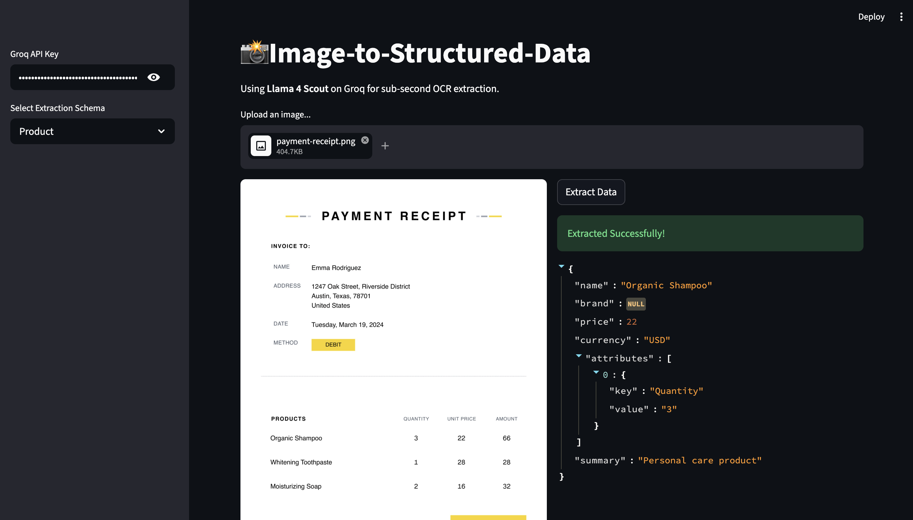

# Image-to-Structured-Data Extractor (Llama 4 Scout + Instructor)

> A high-speed, visual OCR framework that converts any image into validated JSON using Llama 4 Scout and Pydantic.

## Overview

This project demonstrates how to move beyond raw text OCR to **Structured Visual Extraction**. Instead of getting a messy block of text, this tool uses the `instructor` library to force the VLM (Vision Language Model) to output data that fits a strict Pydantic schema. 

**Problem it solves:** Traditionally, extracting specific fields from varying layouts (like different receipt formats or product labels) required complex regex or custom OCR training. This project solves that by using a multimodal LLM to "understand" the visual context and map it directly to code-ready objects.

**Who is this for:** AI Engineers building automated data entry pipelines, invoice processing systems, or cataloging tools.

## Features

- **Schema-First Extraction:** Define your desired output in Python (Pydantic), and the model follows it.
- **SOTA OSS Model:** Uses Llama 4 Scout via Groq for sub-second inference.
- **Auto-Image Optimization:** Intelligent resizing and compression to handle high-res smartphone photos while staying within API pixel limits.
- **Multimodal Validation:** Leverages `instructor` to ensure the JSON output is valid and matches the schema before returning.

## Tech Stack

**Frameworks & Libraries:**
- **Instructor:** For structured data extraction and validation.
- **Pydantic v2:** For defining data schemas.
- **Groq SDK:** For high-speed inference.
- **Pillow (PIL):** For image processing and resizing.

**Additional Tools:**
- **Model:** `meta-llama/llama-4-scout-17b-16e-instruct`
- **Web Framework:** Streamlit (UI)
- **Environment Management:** python-dotenv

## Prerequisites

Before you begin, ensure you have:

- Python 3.10 or higher (Recommended)
- API keys for:
  - [ ] [Groq Cloud Console](https://console.groq.com/)
- Basic understanding of Pydantic and Multimodal LLMs.

## Installation

### 1. Clone the Repository

```bash
git clone https://github.com/Sumanth077/Hands-On-AI-Engineering.git
cd Hands-On-AI-Engineering/OCR/image_to_structured_data
```

### 2. Create Virtual Environment

```bash
python -m venv venv
source venv/bin/activate  # On Windows: venv\Scripts\activate
```

### 3. Install Dependencies

```bash
pip install -r requirements.txt
```

### 4. Set Up Environment Variables

Create a `.env` file in the project directory:

```bash
cp .env.example .env
```

Edit `.env` and add your Groq API key.

## Usage

### Running the Application

```bash
streamlit run app.py
```



**Output (Structured JSON):**

```json
{
  "name": "Organic Shampoo",
  "brand": null,
  "price": 22.0,
  "currency": "USD",
  "attributes": [
    {
      "key": "Quantity",
      "value": "3"
    }
  ],
  "summary": "Personal care product"
}
```

## Project Structure

```
image_to_structured_data/
├── app.py                 # Streamlit UI Layer
├── processor.py           # Logic for image resizing & Instructor calls
├── schemas.py             # Pydantic models (Add new schemas here!)
├── requirements.txt       # Dependencies
├── .env.example           # Environment template
└── README.md              # This file
```

## How It Works

1. **Pre-processing:** The system accepts an image and uses Pillow to check its resolution. If it exceeds Groq's pixel limit (approx. 33M pixels), it resizes the image while maintaining aspect ratio and converts it to a high-quality JPEG to reduce payload size.

2. **Instructor Integration:** It "patches" the Groq client with instructor, enabling `response_model` support.

3. **Structured Prompting:** The image is sent as a base64 encoded string to Llama 4 Scout with a system instruction to map visual cues to the provided Pydantic schema.

4. **Validation:** Pydantic validates the JSON returned by the model. If a field like price is expected as a float but the model returns a string, Pydantic catches the error.
