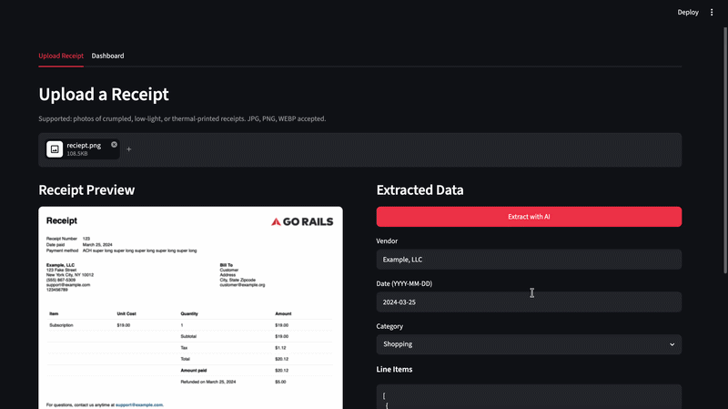

# AI Receipt and Expense Tracker

> A local vision pipeline that extracts structured data from receipt and invoice photos and tracks spending in a personal expense ledger. No API keys required. Runs fully offline after first-run model download.

## Demo



## Overview

Point your phone at a receipt, no matter how crumpled, faded, or thermal-printed it is, and this tool pulls out the vendor, date, line items, subtotal, tax, and total automatically. A Pillow preprocessing step boosts contrast and sharpness before the image reaches the model, which helps significantly with low-light photos and bleached thermal paper.

Extracted data lands in a local SQLite database. The dashboard tab aggregates spending by category and date range so you can see where your money is going without ever touching a cloud service.

## Features

- Fully offline after first-run model download
- Handles crumpled, low-light, and thermal-printed receipts via Pillow preprocessing
- Gemma 4 E2B vision (Q4_K_M GGUF) via llama-cpp-python, auto-detects Metal (Apple Silicon), CUDA, or falls back to CPU
- Extracts vendor, date, line items, subtotal, tax, total, and auto-assigns a spending category
- Editable extraction results before saving, so you can correct anything the model missed
- SQLite ledger via pandas, no database server needed
- Dashboard with spending breakdown by category and date range
- Streamlit web UI

## Minimum System Requirements

| Component | Minimum |
|---|---|
| RAM | 8 GB (unified memory on Apple Silicon counts) |
| Disk space | 4 GB free (3.1 GB model + 557 MB mmproj) |
| Python | 3.9 or higher |
| Internet | Required on first run only, for model download |

The app runs on CPU if no GPU is available, but inference will be slower. Apple Silicon (M1/M2/M3) with Metal and NVIDIA GPUs with CUDA both run noticeably faster.

## Prerequisites

- Python 3.9 or higher
- Internet access on first run only (to download the model and mmproj weights)

### Platform-specific install for llama-cpp-python

llama-cpp-python must be built with the right backend for your hardware.

**CPU only (any machine)**
```bash
pip install llama-cpp-python
```

**NVIDIA GPU (CUDA)**
```bash
CMAKE_ARGS="-DGGML_CUDA=on" pip install llama-cpp-python
```

**Apple Silicon (Metal)**
```bash
CMAKE_ARGS="-DGGML_METAL=on" pip install llama-cpp-python
```

**AMD GPU (ROCm)**
```bash
CMAKE_ARGS="-DGGML_HIPBLAS=on" pip install llama-cpp-python
```

## Setup

```bash
# Clone the repo
git clone https://github.com/Sumanth077/Hands-On-AI-Engineering.git
cd Hands-On-AI-Engineering/OCR/receipt_expense_tracker

# Install llama-cpp-python first using the command above for your hardware, then:
uv sync

# Run
uv run streamlit run app.py
```

On first run the app will download:
1. Gemma 4 E2B Q4_K_M GGUF (~3.1 GB) from `ggml-org/gemma-4-E2B-it-GGUF`
2. The multimodal projector (mmproj) file (~557 MB) used for image encoding

Both files are cached in your local HuggingFace cache (`~/.cache/huggingface/`). Subsequent runs are fully offline.

## Usage

Open `http://localhost:8501` in your browser.

**Upload Receipt tab**: Upload a photo of any receipt or invoice. Click "Extract with AI" to run the vision pipeline. Review and edit the extracted fields, then click "Save to Ledger."

**Dashboard tab**: Filter by date range and category to see totals, a spending breakdown chart, and the full expense ledger. Delete individual entries from the expander at the bottom.

## Model

**Gemma 4 E2B** (`unsloth/gemma-4-E2B-it-GGUF`, Q4_K_M)

| Property | Value |
|---|---|
| Effective parameters | 2.3B (5.1B with per-layer embeddings) |
| Quantization | Q4_K_M |
| Model size on disk | ~3.1 GB |
| Context window | 128K tokens |
| Modalities | Text and image input |
| License | Apache 2.0 |

The model requires a second file alongside the main GGUF: the **multimodal projector (mmproj)** (~557 MB, from `ggml-org/gemma-4-E2B-it-GGUF`). This handles image encoding before the language model sees the receipt. Both files are downloaded automatically on first run and cached in `~/.cache/huggingface/`.

## Tech Stack

| Component | Library |
|---|---|
| Vision model | Gemma 4 E2B (Q4_K_M GGUF) |
| Local inference | llama-cpp-python |
| Image preprocessing | Pillow |
| Data storage | SQLite via pandas |
| UI | Streamlit |

## Project Structure

```
receipt_expense_tracker/
├── app.py                              # Streamlit UI
├── requirements.txt
├── README.md
└── receipt_expense_tracker/
    ├── __init__.py
    ├── extractor.py                    # Vision model loading and receipt extraction
    ├── preprocessor.py                 # Pillow image enhancement pipeline
    └── database.py                     # SQLite read/write helpers
```
