# Eagle Eye

AI-powered GitHub PR review agent using OpenClaw, MiniMax M2.7, and GitHub MCP. Triggered via Telegram.

## Project Overview

Eagle Eye is a Telegram-triggered code review assistant that analyses GitHub pull requests and delivers structured feedback directly to your Telegram chat. It uses MiniMax M2.7 as the reasoning model and the GitHub MCP server to fetch PR diffs and post reviews. Reviews cover security vulnerabilities, bugs, code quality, and best practices, with findings grouped by severity and an overall rating. Nothing is posted to GitHub without your explicit approval.

---

## How It Works



---

## Prerequisites

- **[OpenClaw](https://openclaw.dev)** installed and available in your PATH
- **Telegram bot token**: create a bot via [@BotFather](https://t.me/BotFather) and note the token
- **GitHub Personal Access Token (PAT)**: with `repo`, `pull_requests: write`, and `issues: write` permissions

---

## Setup

### 1. Run `openclaw onboard`

```bash
openclaw onboard
```

When prompted, select **MiniMax M2.7** as your model. OpenClaw will ask for your API key and store it securely in its auth profiles; no need to put it in `openclaw.json`.

### 2. Configure `openclaw.json`

Copy `openclaw.example.json` to `openclaw.json` and fill in your credentials:

```json
{
  "gateway": {
    "mode": "local",
    "auth": {
      "mode": "token",
      "token": "YOUR_OPENCLAW_GATEWAY_TOKEN"
    }
  },
  "channels": {
    "telegram": {
      "enabled": true,
      "botToken": "YOUR_TELEGRAM_BOT_TOKEN"
    }
  },
  "mcp": {
    "servers": {
      "github": {
        "command": "npx",
        "args": ["-y", "@modelcontextprotocol/server-github"],
        "env": {
          "GITHUB_PERSONAL_ACCESS_TOKEN": "YOUR_GITHUB_PAT"
        }
      }
    }
  }
}
```

### 3. Copy the project to your OpenClaw workspace

**macOS / Linux:**
```bash
cp -r . ~/.openclaw/workspace/skills/eagle-eye/
```

**Windows:**
```cmd
xcopy . %USERPROFILE%\.openclaw\workspace\skills\eagle-eye\ /E /I
```

### 4. Start the OpenClaw gateway

```bash
openclaw gateway
```

The agent is now listening for messages on Telegram.

---

## Usage

Send any message containing a GitHub PR URL to your Telegram bot:

```
https://github.com/owner/repo/pull/42
```

Or inline with other text:

```
Please review this: https://github.com/owner/repo/pull/42
```

The agent fetches the PR, analyses the diff, and sends a structured review back to Telegram. It then asks whether you want to post the review to GitHub: reply **`post`** to post it as a GitHub comment, or **`no`** to discard it.

You can also reply with edits or instructions (e.g. *"add a note about the missing tests"*) and the agent will revise the review and ask again.

---

## Known Limitations

- **No CI/CD context**: the agent cannot see test results, build logs, or coverage reports unless you paste them into the chat
- **Large PRs**: for PRs with 200+ changed files, the review prioritises security and correctness findings and may not cover every file exhaustively
- **No session memory**: the agent does not remember previous reviews between Telegram sessions; each conversation starts fresh
- **Single reviewer identity**: the agent posts as whichever GitHub account owns the PAT; it cannot impersonate other reviewers
=======
# **Hands-On AI Engineering** 🚀

A curated repository of AI-powered applications and agentic systems showcasing practical use cases of Large Language Models (LLMs) from providers like Google, Anthropic, OpenAI, and self-hosted open-source models.

## **What’s Inside?**

* 🤖 **AI Agents & Use Cases** – Explore a variety of agent-based AI applications.
* 📚 **RAG (Retrieval-Augmented Generation)** – Implementations of knowledge-enhanced AI models.
* 🚀 **Scalable AI Solutions** – Best practices for building production-ready AI applications.

## **Contributing**

We welcome contributions! If you have an AI app, agent, or enhancement to share, check the **Issues** section and submit a pull request.

## **📜 License**

This repository is licensed under the **MIT License**. See the [LICENSE](./LICENSE) file for details.

