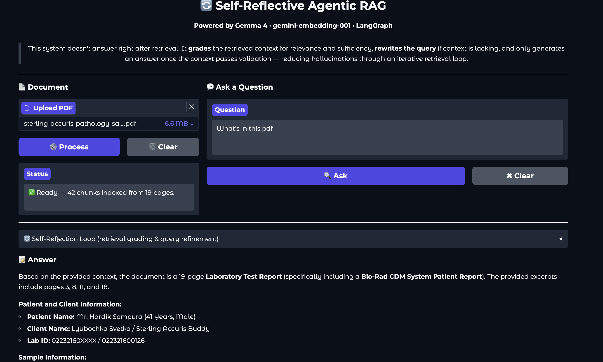

# 🔄 Self-Reflective Agentic RAG



## Overview

Standard RAG pipelines retrieve context and generate an answer immediately — with no check on whether the retrieved chunks are actually relevant or sufficient. This leads to hallucinations when the retrieval misses the mark.

This project solves that by introducing an **iterative retrieval-validation loop** before generation. Instead of answering right away, the system uses a LangGraph-driven state machine to:

1. **Retrieve** context from the vector store
2. **Grade** the retrieved context for relevance, sufficiency, and consistency
3. **Rewrite** the query if the context doesn't pass — and re-retrieve with a better search
4. **Generate** a grounded answer only once the context passes validation

This loop runs up to 3 times, progressively refining the search query until the LLM is confident the context is good enough — or gracefully falls back to the best available context.

## Features

- **Self-Reflection Loop:** LLM grades each retrieval attempt with a structured `VERDICT / REASON / REFINED_QUERY` output before generation
- **Query Rewriting:** On a `NO` verdict, the system rewrites the search query based on what the grader says is missing — not just re-running the same query
- **Iteration Cap:** Hard limit of 3 retrieval loops prevents infinite loops on ambiguous or unanswerable questions
- **Hallucination Reduction:** Answer generation is strictly grounded — the prompt explicitly forbids the model from going beyond the validated context
- **Full Reflection Log:** The UI surfaces the complete per-iteration grading log so you can see exactly why the system looped or stopped
- **Clean Gradio UI:** Process/clear PDF controls, locked Ask button until a document is loaded, collapsible reflection accordion

## Tech Stack

**Frameworks & Libraries:**
- [LangGraph](https://langchain-ai.github.io/langgraph/): State machine orchestration for the retrieval-validation loop
- [LangChain](https://python.langchain.com/): Document loading, text splitting, and ChromaDB integration
- [ChromaDB](https://www.trychroma.com/): Local vector store for chunk storage and similarity search
- [Gradio](https://www.gradio.app/): Interactive web UI

**Models (via Google AI / Gemini API):**
- **LLM:** [`gemma-4-26b-a4b-it`](https://ai.google.dev/gemma/docs/core/gemma_on_gemini_api) — used for retrieval grading, query rewriting, and answer generation
- **Embeddings:** [`gemini-embedding-001`](https://ai.google.dev/gemini-api/docs/embeddings) with `retrieval_document` task type

## How It Works

```
           ┌─────────────┐
           │   retrieve  │◄────────────────────┐
           └──────┬──────┘                      │
                  │                             │
           ┌──────▼──────────┐         ┌────────┴──────────┐
           │ grade_retrieval │──NO ──► │  rewrite_query    │
           └──────┬──────────┘         └───────────────────┘
                  │ YES (or max iterations reached)
           ┌──────▼──────┐
           │   generate  │
           └──────┬──────┘
                  │
                 END
```

**Nodes:**
- **`retrieve`** — Fetches the top-4 most similar chunks using the current query (original or rewritten)
- **`grade_retrieval`** — Prompts Gemma to return a structured `VERDICT: YES/NO`, `REASON`, and `REFINED_QUERY`
- **`rewrite_query`** — Parses `REFINED_QUERY` from the grader output and updates the state
- **`generate`** — Produces the final answer, instructed to stay strictly within the validated context

**Router logic:**
- `VERDICT: YES` → go to `generate`
- `VERDICT: NO` + iterations < 3 → go to `rewrite_query` → `retrieve`
- iterations ≥ 3 → force `generate` with best context available

## Prerequisites

- Python 3.12 or higher
- [uv](https://docs.astral.sh/uv/) (recommended for dependency management)
- A Google AI Studio API key with access to Gemma and Gemini Embedding models

## Installation

### 1. Clone the Repository

```bash
git clone https://github.com/Sumanth077/Hands-On-AI-Engineering.git
cd Hands-On-AI-Engineering/ai_agents/agentic_rag_system
```

### 2. Set Up Environment Variables

```bash
cp .env.example .env
```

Open `.env` and add your key:

```env
GEMINI_API_KEY=your_google_ai_studio_key_here
```

Get your API key at [Google AI Studio](https://aistudio.google.com/app/apikey).

### 3. Install Dependencies

```bash
uv sync
```

## Usage

```bash
uv run main.py
```

Navigate to `http://127.0.0.1:7860` in your browser.

1. **Upload a PDF** using the Document panel on the left
2. Click **⚙️ Process** — the status shows how many chunks were indexed
3. Type a question in the Ask a Question panel and click **🔍 Ask**
4. Expand the **Self-Reflection Loop** accordion to see the per-iteration grading logs
5. Read the grounded answer in the Answer section below
6. Use **🗑️ Clear** to remove the current document and load a new one

## Project Structure

```text
agentic_rag_system/
├── main.py            # Gradio UI and PDF processing logic
├── rag_graph.py       # LangGraph state machine — nodes, edges, router
├── assets/
│   └── demo.png       # App screenshot
├── .env.example       # API key template
├── pyproject.toml     # Project dependencies (uv)
├── uv.lock            # Locked dependency versions
└── README.md
```

## Contributing

Contributions are welcome! Please feel free to submit a Pull Request.

## License

This project is licensed under the MIT License — see the [LICENSE](../../LICENSE) file for details.

---

[⬆ Back to Top](#-self-reflective-agentic-rag)
