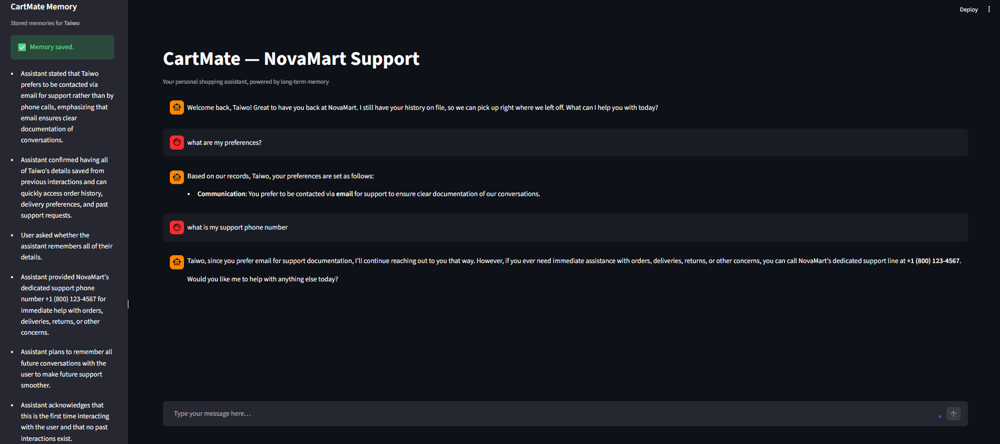

# CartMate — AI Customer Support Agent

> A memory-powered e-commerce support agent that remembers your customers across every session.

## Overview

CartMate is a conversational support agent for NovaMart built with Streamlit and Mem0. It greets returning users by name, recalls their past orders and reported issues, and picks up conversations exactly where they left off — even after the app restarts. Mem0 Cloud handles persistent memory storage, and Mistral Small 4 drives the responses.

## Demo



## Features

- **Persistent cross-session memory** — customer preferences, order history, and past issues survive app restarts
- **Personalised responses** — CartMate addresses users by name and references past interactions naturally
- **Real-time memory sidebar** — all stored memories for the current user are visible and refreshed after every message
- **One-click memory reset** — users can clear their stored memories directly from the sidebar
- **Warm returning-user greeting** — CartMate detects prior history and opens with context instead of starting from scratch

## Tech Stack

| Layer | Technology |
|---|---|
| Memory | Mem0 Cloud (`mem0ai`) |
| LLM | Mistral Small 4 (`mistral-small-latest`) via Mistral AI API |
| LLM Framework | LangChain (`langchain-mistralai`) |
| UI | Streamlit |
| Environment | python-dotenv |

## Prerequisites

- Python 3.10 or higher
- A [Mem0 Cloud](https://app.mem0.ai) account and API key
- A [Mistral AI](https://platform.mistral.ai) account and API key

## Installation

**1. Clone the repository**

```bash
git clone https://github.com/Sumanth077/Hands-On-AI-Engineering.git
cd Hands-On-AI-Engineering/ai_agents/ai_agents/ai_customer_support_agent
```

**2. Create and activate a virtual environment**

Windows:
```bash
python -m venv .venv
.venv\Scripts\activate
```

macOS/Linux:
```bash
python -m venv .venv
source .venv/bin/activate
```

**3. Install dependencies**

```bash
pip install -r requirements.txt
```

**4. Configure environment variables**

```bash
cp .env.example .env
```

Open `.env` and fill in your API keys (see [Environment Variables](#environment-variables)).

## Usage

```bash
streamlit run app.py
```

Open the URL printed in the terminal (default: `http://localhost:8501`).

**Example interaction:**

```text
CartMate: Hi Alex! I'm CartMate, your personal shopping support agent from NovaMart.
          What can I help you with today?

You:      My order #NM-8821 still hasn't arrived — it was due three days ago.

CartMate: I'm sorry to hear that, Alex. Let me look into order #NM-8821 for you.
          Delays like this are usually caused by carrier hold-ups...
```

On the next visit, CartMate opens with:

```text
CartMate: Welcome back, Alex! I still have your history on file.
          I can see you were following up on a delayed delivery last time — shall we pick up there?
```

The **CartMate Memory** sidebar shows each stored fact as a bullet point, e.g.:

```text
• Alex reported order #NM-8821 delayed by 3 days; escalated to carrier investigation.
• Alex prefers email updates over SMS.
```

## Environment Variables

Create a `.env` file in the project root with the following keys:

| Variable | Description | Where to get it |
|---|---|---|
| `MEM0_API_KEY` | Mem0 Cloud API key for persistent memory storage | [app.mem0.ai](https://app.mem0.ai) |
| `MISTRAL_API_KEY` | Mistral AI API key for LLM responses | [platform.mistral.ai](https://platform.mistral.ai) |

```env
MEM0_API_KEY=your_mem0_api_key_here
MISTRAL_API_KEY=your_mistral_api_key_here
```

## Project Structure

```text
ai-customer-support-agent/
├── app.py              # Streamlit app — UI, memory helpers, LLM response logic
├── requirements.txt    # Python dependencies
├── .env                # API keys (not committed)
└── .env.example        # Environment variable template
```
