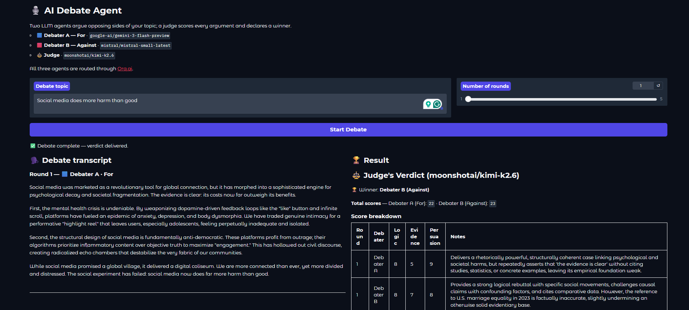

# AI Debate Agent

> Two LLM debaters argue opposing sides of any topic you choose; a judge scores every turn and declares a winner.

## Overview

AI Debate Agent is a multi-agent application that runs structured debates between two language models and an impartial judge. You supply a topic and round count (1 to 5); Debater A argues for, Debater B argues against, and they alternate while responding to each other's latest points. When rounds finish, a judge reviews the full transcript, scores each argument on logic, evidence, and persuasiveness, and returns a winner with a written verdict. The Gradio interface streams the transcript live as each agent speaks.

## Demo



## Features

- **Dual debaters** with fixed roles: Debater A (For) and Debater B (Against)
- **Configurable rounds** from 1 to 5, with each round consisting of one turn per debater
- **Context-aware rebuttals** where each debater sees the full transcript before speaking
- **Impartial judge** that scores every argument and declares a winner with reasoning
- **Live streaming UI** that updates the transcript and status after each agent turn
- **Single API key** for all models via the [Orq.ai](https://orq.ai/) router
- **Optional connectivity test** (`test_orq.py`) to verify models before launching the app

## Tech Stack

**Frameworks & Libraries:**

- [LangGraph](https://langchain-ai.github.io/langgraph/) for multi-agent orchestration
- [LangChain Core](https://python.langchain.com/) for graph state typing
- [OpenAI Python SDK](https://github.com/openai/openai-python) (Orq.ai-compatible client)
- [Gradio](https://www.gradio.app/) for the web UI
- [python-dotenv](https://github.com/theskumar/python-dotenv) for environment configuration

**Additional Tools:**

- **Orchestration:** LangGraph
- **Web Framework:** Gradio
- **Model routing:** [Orq.ai](https://orq.ai/) AI Router (`https://api.orq.ai/v3/router`)

| Agent | Role | Default model (Orq.ai) |
|-------|------|-------------------------|
| Debater A | For | `google-ai/gemini-3-flash-preview` |
| Debater B | Against | `mistral/mistral-small-latest` |
| Judge | Scoring and verdict | `moonshotai/kimi-k2.6` |

## Prerequisites

- Python 3.10 or higher
- API keys for:
  - **Orq.ai** (`ORQ_API_KEY`) from the [Orq.ai dashboard](https://orq.ai/)
- **Orq.ai provider setup:** In AI Router, connect the providers you use (for example Google AI, Mistral, and Moonshot AI) and add the underlying provider API keys so routed models can run.

## Installation

### 1. Clone the Repository

```bash
git clone https://github.com/Sumanth077/Hands-On-AI-Engineering.git
cd Hands-On-AI-Engineering/ai_agents/ai_debate_agent
```

### 2. Create Virtual Environment (Recommended)

```bash
python -m venv venv
```

**Windows:**

```bash
venv\Scripts\activate
```

**macOS/Linux:**

```bash
source venv/bin/activate
```

### 3. Install Dependencies

```bash
pip install -r requirements.txt
```

### 4. Set Up Environment Variables

```bash
cp .env.example .env
```

Edit `.env` and set your Orq.ai API key:

```env
ORQ_API_KEY=your-orq-api-key-here
```

Optional overrides:

| Variable | Description |
|----------|-------------|
| `DEBATER_A_MODEL` | For-side model (default: `google-ai/gemini-3-flash-preview`) |
| `DEBATER_B_MODEL` | Against-side model (default: `mistral/mistral-small-latest`) |
| `JUDGE_MODEL` | Judge model (default: `moonshotai/kimi-k2.6`) |
| `ORQ_TEMPERATURE` | Sampling temperature for all agents (default: `1`; required by some models) |

Verify connectivity (optional):

```bash
py test_orq.py
```

## Usage

### Running the Application

```bash
gradio app.py
```

You can also run:

```bash
python app.py
```

Open the local URL shown in the terminal (typically `http://127.0.0.1:7860`). Enter a debate topic, select the number of rounds (1 to 5), and click **Start Debate**.

### Example Usage

| Debate topic | Rounds | What you get |
|--------------|--------|--------------|
| Social media does more harm than good | 3 | Alternating For/Against arguments across 3 rounds, then a judge verdict with per-argument scores and a declared winner |
| Remote work is better than working in an office | 2 | Two rounds of rebuttals, streamed transcript, and a scored breakdown (logic, evidence, persuasiveness) |
| Artificial intelligence should be heavily regulated | 3 | Full debate transcript with live updates, total scores per debater, and written judge reasoning |
| Space exploration is worth the cost | 2 | Concise two-round debate ending in a winner (Debater A, Debater B, or Tie) and comments per argument |

**Typical output sections:**

1. **Debate transcript** (markdown): each round labeled with Debater A (For) or Debater B (Against)
2. **Judge's verdict**: score table, totals, winner, and short explanation

## Project Structure

```
ai_debate_agent/
├── app.py              # Gradio UI and streaming debate handler
├── debate.py           # LangGraph graph (Debater A, Debater B, Judge)
├── test_orq.py         # Smoke test for Orq.ai model connectivity
├── requirements.txt    # Python dependencies
├── .env.example        # Environment variable template
├── .gitignore
├── README.md
└── assets/
    └── demo.png        # Demo screenshot for the README
```

## How It Works

1. **Topic input**  
   The user enters a topic and round count in Gradio. `debate_handler` in `app.py` calls `run_debate()` in `debate.py`.

2. **Graph setup**  
   LangGraph builds a stateful graph with shared `DebateState`: topic, `max_rounds`, `round_num`, `transcript`, and `verdict`. All three agents use one Orq.ai client (`OpenAI` SDK with base URL `https://api.orq.ai/v3/router`).

3. **Debater A (For)**  
   The first node calls `google-ai/gemini-3-flash-preview` with the topic and an empty transcript. The model returns the opening argument for the For side.

4. **Debater B (Against)**  
   The second node calls `mistral/mistral-small-latest` with the transcript including Debater A's latest turn. It returns the Against argument and increments `round_num`.

5. **Round loop**  
   A conditional edge checks `round_num <= max_rounds`. If more rounds remain, control returns to Debater A with the updated transcript. Each debater is prompted to rebut the opponent's most recent point. If rounds are complete, the graph routes to the judge.

6. **Judge**  
   The judge node sends the full transcript to `moonshotai/kimi-k2.6` with a structured JSON scoring prompt. Each argument receives scores (1 to 10) for logic, evidence, and persuasiveness. The app parses the response, recomputes totals, and sets the winner and verdict text.

7. **Streaming to the UI**  
   The graph runs with `stream_mode="values"`. After every node, `run_debate` yields the current state. Gradio renders the transcript and verdict panels incrementally until the debate completes.

**Graph flow:**

```
START -> debater_a -> debater_b -> (more rounds? -> debater_a : judge) -> END
```
