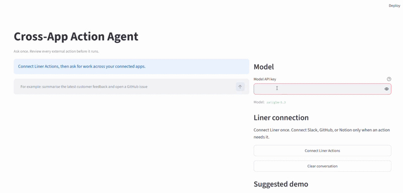
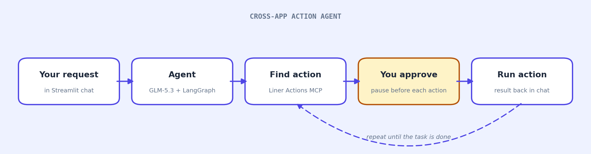

# Cross-App Action Agent



An approval-first LangGraph agent that uses Liner Actions MCP to discover and run work across connected apps from one plain-English request.

## Overview

**Cross-app action** means doing work that spans more than one app from a single request, for example reading a Slack channel and opening a GitHub issue about a bug mentioned there, without wiring up each app yourself first.

**[Liner Actions MCP](https://liner.com/developers/docs/actions-mcp)** is a single remote connection (an MCP server) that lets the agent discover and run those actions across roughly 1,100 apps. The agent calls a few tools on it:

- `search_actions` finds the right Action for your request in natural language.
- `connect_account` links a service the first time an Action needs it, through Liner's browser sign-in.
- `complete_connection` confirms that connection once you finish it in the browser.
- `execute_action` runs the chosen Action and returns the result.

Most cross-app workflows begin with manual setup. You connect an app, find the feature you need, and repeat the process for every new workflow. This project gives an agent one remote Liner Actions MCP connection instead. The agent searches for a suitable Action at runtime, asks you to connect an account only when it needs that service, and reports the result in the same chat.

The agent uses `zai/glm-5.3` through a gateway API. LangGraph manages the conversation and pauses before every `execute_action` call. That pause makes the agent's proposed external action visible before it can post a message, create an issue, or otherwise act in a connected account.

The first strong demo uses Slack and GitHub. Ask the agent to read a channel in your workspace and open an issue for a bug it finds. Liner Actions resolves the app-specific Actions only when the request arrives.

## How It Works



1. You enter a task in the Streamlit chat interface.
2. `zai/glm-5.3` asks Liner Actions MCP to search for the next Action.
3. If an account is not connected, Liner opens its connection flow in your browser.
4. LangGraph pauses before an `execute_action` call and shows the proposed arguments.
5. After you approve, the agent executes one Action and continues until the workflow is complete.

Liner Actions MCP uses Streamable HTTP and OAuth 2.1. Liner stores credentials for connected services, so this project does not receive Slack, GitHub, or Notion access tokens. The local OAuth session is kept in memory while the application is running. Restarting the app can require you to sign in to Liner again.

## Tech Stack

| Component | Choice |
| --- | --- |
| Agent framework | LangGraph |
| App actions | Liner Actions MCP |
| MCP client and OAuth | FastMCP |
| LLM | `zai/glm-5.3` |
| Human approval | LangGraph `interrupt()` |
| Interface | Streamlit |
| Dependency management | uv |

## Prerequisites

- Python 3.10 or higher.
- [uv](https://docs.astral.sh/uv/getting-started/installation/).
- Vercel AI Gateway API key for `zai/glm-5.3`.
- A [Liner Actions](https://actions.liner.com/) account.
- A browser that can open the Liner OAuth sign-in and service connection pages.

The default model is `zai/glm-5.3`. It supports the structured tool calls the agent uses to find and run Liner Actions. You can set the API key in `.env` or enter it in the password field in the application. An entered key remains only for the active browser session.

## Setup

Open PowerShell or a VS Code terminal in this project folder.

```powershell
cd C:\Users\USER\Hands-On-AI-Engineering\ai_agents\cross_app_action_agent
```

Install the project dependencies with uv.

```powershell
uv sync --extra dev
```

Copy the environment template.

```powershell
Copy-Item .env.example .env
```

Add your API key to `.env` or leave `AI_GATEWAY_API_KEY` blank and enter the key in the application. The remaining default values work with the hosted Liner MCP endpoint and `zai/glm-5.3`.

## Running

Start the Streamlit application through uv. Do not use a global `streamlit` command, because Anaconda or another Python installation may not have this project's dependencies.

```powershell
uv run streamlit run main.py
```

If you have already run `uv sync` and a later `uv run` attempt times out while checking PyPI, start the installed project environment without another sync:

```powershell
uv run --no-sync streamlit run main.py
```

Open [http://localhost:8501](http://localhost:8501). Select **Connect Liner Actions**. FastMCP opens your browser so you can sign in to Liner and approve the MCP connection. Return to the Streamlit page after sign-in finishes.

The first time a task needs Slack, GitHub, Notion, or another service, Liner returns a connection link. Complete that service connection in the browser, then tell the agent you have finished. The agent calls Liner's `complete_connection` tool and continues the original task.

## Project Structure

```text
cross_app_action_agent/
├── agent.py                 # LangGraph nodes, tool review, and pause logic
├── mcp_client.py            # Liner Actions MCP connection and OAuth client
├── main.py                  # Streamlit chat and approval interface
├── pyproject.toml           # uv project dependencies
├── .env.example             # Local model and MCP configuration
├── tests/
│   └── test_agent.py        # Approval policy checks
└── assets/
    └── how_it_works.png
```

## Customising

The default prompt requires the model to search for Actions before it executes them and to use one tool call at a time. This produces a readable activity flow and creates a review point for each external operation.

The graph currently requires approval for every `execute_action` request. Liner can use `execute_action` for read or write operations, so the project does not guess the action's impact from its name. A production deployment can use Liner's Action risk metadata and a stricter organization-specific policy to automate selected read-only Actions.

The app uses `zai/glm-5.3` by default. To use another compatible model, update `AI_MODEL` in `.env` and restart Streamlit. You can also change `LINER_OAUTH_CALLBACK_PORT` if port `8765` is already in use.

## Demo

Connect Liner Actions in the live app and use this request:

```text
Summarise the latest messages in your Slack channel and create a GitHub issue
for a bug mentioned there.
```

Replace `your Slack channel` with a channel that exists in your workspace. The agent first discovers the required Actions. It pauses before every Action execution, so you can inspect and approve the Slack and GitHub work before it occurs.

## Resources

- [Liner Actions MCP documentation](https://liner.com/developers/docs/actions-mcp)
- [Liner Actions directory](https://actions.liner.com/)
- [LangGraph human-in-the-loop documentation](https://langchain-ai.github.io/langgraph/how-tos/human_in_the_loop/review-tool-calls/)
- [FastMCP OAuth client documentation](https://gofastmcp.com/clients/auth/oauth)
- [AI Gateway model directory](https://vercel.com/ai-gateway/models)
