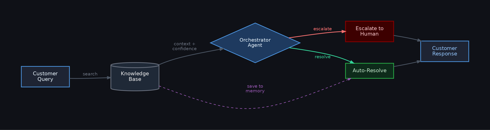

# Customer Query Routing and Resolution Agent

> A fully offline AI agent that routes incoming customer support queries to the right department and generates grounded responses, powered by [Actian VectorAI](https://www.actian.com/databases/vectorai-db/) DB as the memory and retrieval layer.

## Demo


## Overview

Every customer support team has the same problem: a firehose of queries that need to go to the right person and get a consistent answer. This agent handles the first two steps automatically.

When a query comes in, the agent embeds it and searches four VectorAI DB collections simultaneously: FAQ entries, policy documents, resolved ticket threads, and a growing memory store of previously resolved queries. Before any response is generated, an orchestrator agent (Ministral 3B) reasons over the query, the retrieval confidence score, and pre-detected signals to decide whether to resolve the query automatically or escalate it to a human agent.

For queries that can be resolved, the LLM generates a response grounded in the retrieved context. For queries that need escalation (high frustration, legal language, urgency, or repeated contact) the customer receives a structured handoff message with a case reference number and a response time window. No resolution is attempted.

The memory layer is what sets this apart from a simple FAQ retrieval system. Every resolved query can be saved back to VectorAI DB. The next time a similar question arrives, the agent draws on that memory alongside the static sources. The memory grows without any retraining or index rebuilding. VectorAI DB handles storage and retrieval; Ministral 3B handles reasoning and response generation.

## Features

- LLM orchestrator agent (Ministral 3B) reasons over every incoming query and decides whether to resolve or escalate -- before any response-generation call happens
- Semantic query routing across 5 departments: Returns & Refunds, Billing & Payments, Technical Support, Order Tracking, and General Inquiry
- Four-collection VectorAI DB architecture: FAQ knowledge base, policy documents, resolved ticket threads, and persistent agent memory
- Confidence scoring per query: High, Medium, and Low, with the orchestrator factoring low confidence into its routing decision
- Two distinct LLM response paths: grounded resolution (RAG answer) and empathetic escalation acknowledgment (no resolution attempt, ESC-XXXXXX case reference)
- Orchestrator fallback: if the LLM output cannot be parsed, the pipeline falls back to a deterministic regex-only decision and never hard-fails
- Chat-style Streamlit UI: continuous conversation thread with example messages, clear button, and a collapsible details panel per message for developers to inspect orchestrator scores and routing decisions
- Past resolutions tab: search previously saved resolutions by semantic query
- Fully offline after first run: VectorAI DB runs locally via Docker, models are cached by HuggingFace

## Architecture



The orchestrator agent is the routing brain. It receives the raw query, the VectorAI DB confidence score, and pre-detected signals from a fast regex pass. It reasons over all of that and outputs a structured JSON decision, which path to take and why, before any response-generation LLM call happens.

VectorAI DB is the retrieval layer. It stores vectors across all four collections and retrieves the most semantically similar content on each query. All four sources are searched simultaneously and the results are merged and ranked before being passed downstream.

Ministral 3B serves three roles: orchestrator (routing decision), resolver (grounded answer generation), and escalation handler (empathetic case handoff). The same model instance is reused across all three roles.

## Minimum System Requirements

| Component | Minimum |
|---|---|
| RAM | 8 GB |
| Disk space | 4 GB free (2.4 GB model + Docker image) |
| Python | 3.10 or higher |
| Docker | Required for VectorAI DB |
| Internet | Required on first run only |

## Prerequisites

- Python 3.10 or higher
- Docker Desktop (or Docker Engine) installed and running
- Internet access on first run (to pull the VectorAI DB image and download the LLM)

### Platform-specific install for llama-cpp-python

llama-cpp-python compiles against your hardware. Install it before running `uv sync`:

| Hardware | Install command |
|---|---|
| CPU only | `pip install llama-cpp-python` |
| NVIDIA GPU (CUDA) | `CMAKE_ARGS="-DGGML_CUDA=on" pip install llama-cpp-python` |
| Apple Silicon (Metal) | `CMAKE_ARGS="-DGGML_METAL=on" pip install llama-cpp-python` |
| AMD GPU (ROCm) | `CMAKE_ARGS="-DGGML_HIPBLAS=on" pip install llama-cpp-python` |

## Setup

```bash
# Clone the repo
git clone https://github.com/Sumanth077/Hands-On-AI-Engineering.git
cd Hands-On-AI-Engineering/ai_agents/customer_query_routing_agent

# Copy and configure environment
cp .env.example .env

# Start VectorAI DB
docker compose up -d

# Install llama-cpp-python for your hardware (see table above), then:
uv sync

# Run
uv run streamlit run app.py
```

On first run the app will:
1. Connect to VectorAI DB and create all four collections
2. Seed the collections with 25 FAQ entries, 8 policy documents, and 8 resolved ticket threads
3. Download Ministral 3B Q4_K_M (~2.4 GB) from HuggingFace if not already cached
4. Load the embedding model (`all-MiniLM-L6-v2`, ~90 MB, also cached)

To load the additional 10 same-org ticket threads from `data/sample_tickets.json`, run the ingestion script after the app has started at least once:

```bash
uv run python scripts/ingest_tickets.py
```

Subsequent runs are fully offline. The VectorAI DB data persists in `./vectorai_data/` between restarts.

## Usage

Open `http://localhost:8501` in your browser.

**Chat tab:** Type or select an example message and submit it. The agent responds in a chat thread. If the query is resolved, a Save to memory button appears under the response; click it to persist the resolution for future queries. If the query is escalated, the response includes a case reference number and a response time window. A collapsible Details panel under each response shows the orchestrator's reasoning, scores, and routing decision for developers and reviewers.

**Past resolutions tab:** Search previously saved resolutions by semantic query. Results show the original message, the saved response, and the similarity score.

## VectorAI DB Collections

Four collections form the unified context layer. Every incoming query is searched against all four simultaneously.

| Collection | Source | Grows over time? |
|---|---|---|
| `product_faq` | 25 pre-seeded Q&A pairs (auto-seeded on first run) | No |
| `product_docs` | 8 policy documents: return policy, billing T&Cs, shipping, warranty, privacy, disputes | No |
| `resolved_tickets` | Historical support ticket threads (auto-seeded + real-world data via ingest script) | Via script |
| `resolved_queries` | Persistent agent memory: every resolution saved by the user | Yes |

Results from all four collections are labelled by source and merged before being passed to the LLM as unified context.

## Ingesting Additional Ticket Data

The project ships with an ingestion script that reads resolved ticket threads from a JSON export and upserts them into VectorAI DB. In production this JSON file would be an export from your helpdesk platform (Zendesk, Freshdesk, Salesforce Service Cloud, or similar). The repo includes `data/sample_tickets.json` with 10 realistic ticket threads that match the same organisation as the FAQs and policy docs.

```bash
# Default: ingests data/sample_tickets.json
uv run python scripts/ingest_tickets.py

# Point at your own helpdesk export
uv run python scripts/ingest_tickets.py --file path/to/your_export.json
```

This adds 10 ticket threads across all 5 departments to the `resolved_tickets` collection, supplementing the 8 pre-seeded examples already in the knowledge base. The script is idempotent: tickets whose `ticket_id` is already present are skipped, so re-running it is safe.

The JSON format expected by the script:

```json
[
  {
    "ticket_id": "TKT-0041",
    "summary": "Brief description of the issue",
    "thread": "Full conversation transcript between customer and agent",
    "department": "Returns & Refunds",
    "resolution_type": "store_credit"
  }
]
```

This is what the unified context layer looks like in practice: FAQs written by the support team, policy documents authored by legal and ops, and ticket threads exported from the helpdesk system all stored and retrieved through the same VectorAI DB interface. The data comes from different parts of the organisation but belongs to the same organisation throughout.

## Models

| Component | Model | Size |
|---|---|---|
| Embeddings | all-MiniLM-L6-v2 | ~90 MB, 384-dim vectors |
| Language model | Ministral 3B Instruct Q4_K_M | ~2.4 GB |

Both models download automatically on first run and are cached in `~/.cache/huggingface/`. If you have used these models in other projects, they will not be re-downloaded.

## Tech Stack

| Component | Library |
|---|---|
| Vector database | [Actian VectorAI DB (Docker)](https://www.actian.com/databases/vectorai-db/) |
| Vector DB client | actian-vectorai-client |
| Embeddings | sentence-transformers (all-MiniLM-L6-v2) |
| Language model | Ministral 3B via llama-cpp-python |
| UI | Streamlit |
| Package manager | uv |

## Project Structure

```
customer_query_routing_agent/
├── app.py                                  # Streamlit UI
├── docker-compose.yml                      # VectorAI DB server
├── pyproject.toml                          # Dependencies (uv)
├── .env.example                            # VectorAI DB connection config
├── README.md
├── data/
│   └── sample_tickets.json                # 10 same-org resolved ticket threads
├── scripts/
│   └── ingest_tickets.py                  # Ingests ticket JSON into VectorAI DB
└── customer_query_routing_agent/
    ├── config.py                           # Constants, thresholds, environment config
    ├── embedder.py                         # SentenceTransformers wrapper
    ├── vectorstore.py                      # VectorAI DB client, collections, seed data
    ├── router.py                           # Semantic routing: department + confidence
    ├── orchestrator.py                     # LLM orchestrator agent: resolve vs escalate
    └── resolver.py                         # Ministral 3B: resolution + escalation paths
```

## Stopping VectorAI DB

```bash
docker compose down
```

VectorAI DB data persists in `./vectorai_data/` and is available again when you run `docker compose up -d`.
