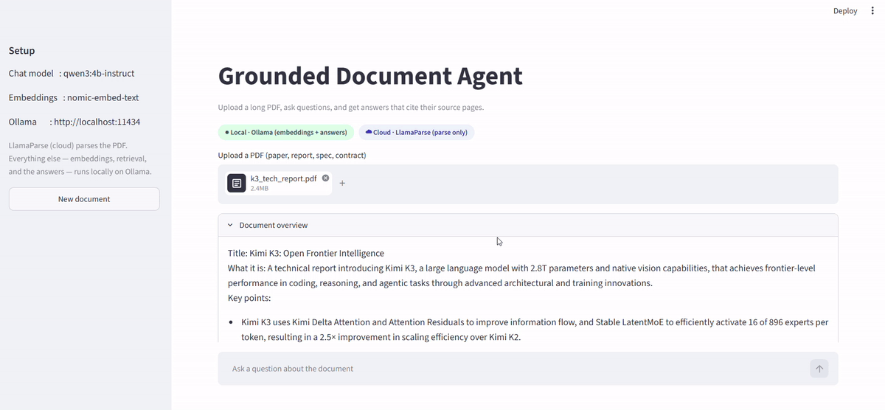
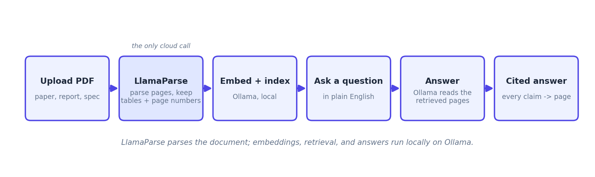

# Grounded Document Agent



Ask questions about a long PDF and get answers that cite the exact pages they came from. Parsing is done by [LlamaParse by LlamaIndex](https://www.llamaindex.ai/llamaparse); the answers run locally on Ollama.

## Overview

Most "chat with your PDF" demos give you an answer and leave you to trust it. This one grounds every answer: you upload a document, ask a question in plain English, and the agent answers using only the pages it retrieved, with numbered `[1]`, `[2]` citations you can expand to see the exact source text and the page it lives on.

The one thing that leaves your machine is the parse. That is on purpose, and it is the point. Long documents (research papers, annual reports, technical specs) hide their most useful content in tables, figures, and multi-column layouts that generic PDF parsers mangle. LlamaParse reads them properly and keeps the page each piece came from, which is exactly what makes the citations trustworthy. Everything after the parse (embeddings, retrieval, and the answers) runs locally on Ollama, so your questions and the model never leave your machine.

## How It Works



1. **Upload a PDF.** The file is parsed once and cached by its content hash, so re-opening it is instant and costs no credits.
2. **Parse with LlamaParse.** The document becomes layout-aware markdown, one chunk per page, with the page number attached to every chunk.
3. **Embed and index, locally.** Ollama produces the embeddings; the vector index is stored on disk.
4. **Ask a question.** The most relevant pages are retrieved and passed to the local model.
5. **Answer, grounded.** The model answers using only those pages and cites them inline.
6. **Verify.** Expand any citation to read the exact source text and see its page.

## Tech Stack

| Layer | Choice |
|---|---|
| Document parsing | LlamaParse (LlamaCloud), layout-aware markdown with page metadata |
| Framework | LlamaIndex (`VectorStoreIndex`, `CitationQueryEngine`) |
| LLM | Local, via Ollama (default `qwen3:4b-instruct`) |
| Embeddings | Local, via Ollama (default `nomic-embed-text`) |
| Vector store | LlamaIndex on-disk index (no external database) |
| UI | Streamlit |
| Packaging | Python 3.10+, `uv`, `pyproject.toml` |

## Prerequisites

**1. Ollama, running locally, with a chat model and an embedding model.** Install from https://ollama.com. The default chat model is `qwen3:4b-instruct` (small, fast, clean instruct output); any instruct model works. You always need an embedding model:

```bash
ollama pull qwen3:4b-instruct   # the chat model (or use one you already have; set OLLAMA_MODEL in .env)
ollama pull nomic-embed-text    # the embedding model (required)
```

The Ollama app keeps the server running at `http://localhost:11434`. For higher answer quality on a stronger machine, pull an 8B model (for example `llama3.1:8b` or `qwen2.5:7b-instruct`) and set `OLLAMA_MODEL` in `.env`.

**2. A LlamaCloud API key.** Create one at https://cloud.llamaindex.ai (Settings -> API Keys). Signup includes $250 in free credits, which is far more than this project needs (a PDF is parsed once and cached).

**3. Python 3.10+ and `uv`.** Install `uv` from https://docs.astral.sh/uv/ if you don't have it.

## Installation

```bash
uv venv
source .venv/bin/activate        # Windows: .venv\Scripts\activate
uv pip install -e .
cp .env.example .env             # then open .env and paste your LLAMA_CLOUD_API_KEY
```

## Running

Make sure Ollama is running, then:

```bash
streamlit run app.py
```

Streamlit opens `http://localhost:8501`. Upload a PDF, wait for the overview, and start asking questions. The first parse of a document takes a moment; after that it is cached.

**How to verify it works:**
- The sidebar shows your chat model, embedding model, and Ollama URL.
- After upload, a short document overview appears.
- Ask a question and you get an answer with `[1]`, `[2]` markers; each expander shows the source text and page.

## Project Structure

```
grounded_document_agent/
├── app.py                     # Streamlit UI (upload -> overview -> chat with citations)
├── grounded_agent/
│   ├── config.py              # env settings + wiring LlamaIndex to local Ollama
│   ├── parser.py              # LlamaParse: PDF -> page-level Documents (cached by file hash)
│   ├── indexer.py             # build/load the on-disk vector index (Ollama embeddings)
│   ├── query.py               # CitationQueryEngine: grounded answers + citations
│   └── overview.py            # short document overview before Q&A
├── assets/
│   └── how_it_works.png
├── pyproject.toml
├── .env.example
├── .gitignore
└── README.md
```

## Customising

- **Swap the model.** Set `OLLAMA_MODEL` in `.env` to any model you have pulled.
- **Tune retrieval.** `SIMILARITY_TOP_K` (how many pages to retrieve) and `CITATION_CHUNK_SIZE` (how granular each citation is) are in `.env`.
- **Use LlamaExtract for the overview.** `overview.py` uses the local model. For a schema-validated structured overview (title, authors, key findings as JSON), swap in `LlamaExtract` from `llama_cloud_services`.
- **Deep-link citations into the PDF.** The page number is on every citation. A next step is to render the PDF and jump to that page when a citation is clicked.

## Demo

Upload a research paper or an annual report and ask something whose answer lives in a table (for example "what were the reported results on the benchmark?" or "what were total revenues by segment?"). The answer cites the page and the expander shows the table it came from.

## Resources

- LlamaParse: https://www.llamaindex.ai/llamaparse
- LlamaParse docs (Python usage): https://developers.llamaindex.ai/llamaparse/
- CitationQueryEngine: https://developers.llamaindex.ai/python/examples/query_engine/citation_query_engine/
- Ollama: https://ollama.com
