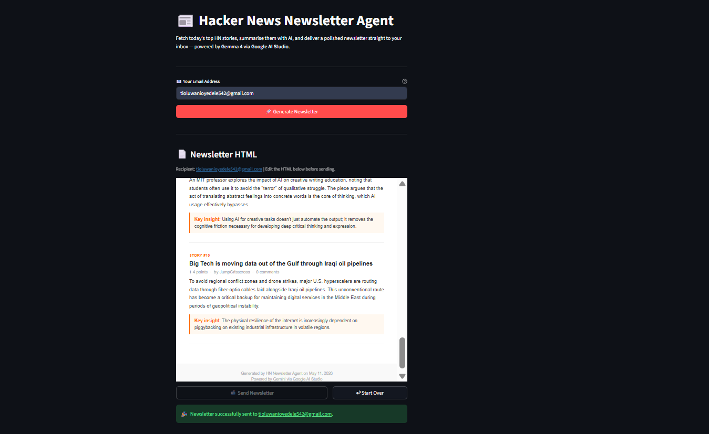

# Hacker News Newsletter Agent

> Fetch the latest tech stories from Hacker News, summarise them with Gemma 4, and deliver a polished HTML newsletter straight to your inbox.

## Overview

Hacker News Newsletter Agent is a Streamlit app that automates the full newsletter pipeline: it pulls the 10 most recent tech stories from Hacker News, scrapes the full article content, generates a clean structured HTML newsletter using Gemma 4 via Google AI Studio, lets you preview it in the browser, and sends it to any email address via Gmail SMTP — all in one click.

## Demo



## Features

- Fetches the 10 latest tech stories from Hacker News via the Algolia Search API (no API key required)
- Scrapes full article content with Trafilatura for richer summarisation
- Generates a structured HTML newsletter with story summaries and key insights using Gemma 4
- Live newsletter preview rendered in the Streamlit UI before sending
- Delivers the newsletter via Gmail SMTP with SSL encryption
- Single-page Streamlit UI: enter your email and click generate

## Tech Stack

| Layer | Technology |
|---|---|
| LLM | Gemma 4 (`gemma-4-31b-it`) via Google AI Studio (`google-genai`) |
| News Fetching | Hacker News Algolia API (free, no API key needed) |
| Content Extraction | `trafilatura` |
| Email Delivery | `smtplib` via Gmail SMTP on port 465 (SSL) |
| UI | Streamlit |

## Prerequisites

- Python 3.10 or higher
- A [Google AI Studio](https://aistudio.google.com/apikey) account (free tier works)
- A Gmail account with [2-Step Verification](https://myaccount.google.com/security) enabled

## Installation

**1. Clone the repository**

```bash
git clone https://github.com/Sumanth077/Hands-On-AI-Engineering.git
cd Hands-On-AI-Engineering/ai_agents/hacker_news_newsletter_agent
```

**2. Create and activate a virtual environment**

Windows:
```bash
python -m venv .venv
.venv\Scripts\activate
```

macOS / Linux:
```bash
python -m venv .venv
source .venv/bin/activate
```

**3. Install dependencies**

```bash
pip install -r requirements.txt
```

**4. Configure environment variables**

```bash
cp .env.example .env
```

Open `.env` and fill in your credentials (see [Environment Variables](#environment-variables) below).

## Environment Variables

| Variable | Description |
|---|---|
| `GOOGLE_API_KEY` | API key from [aistudio.google.com](https://aistudio.google.com/apikey) |
| `GMAIL_ADDRESS` | The Gmail address the newsletter is sent from |
| `GMAIL_APP_PASSWORD` | 16-character App Password from [myaccount.google.com/apppasswords](https://myaccount.google.com/apppasswords); remove spaces when copying |

> **Note:** Gmail App Passwords require 2-Step Verification to be enabled. Do not use your regular Gmail password.

```env
GOOGLE_API_KEY=your_google_api_key_here
GMAIL_ADDRESS=your_gmail_address@gmail.com
GMAIL_APP_PASSWORD=your16charapppassword
```

## Usage

```bash
streamlit run app.py
```

1. Enter your email address in the input field
2. Click **Generate Newsletter**
3. Wait while the app fetches stories, scrapes content, and generates the newsletter (~30–60 seconds)
4. Review the rendered HTML preview
5. Click **Send Newsletter** to deliver it to your inbox

## Project Structure

```text
hacker-news-newsletter-agent/
├── app.py              # Streamlit UI and pipeline orchestration
├── tools.py            # Core functions: fetch, scrape, generate, send
├── requirements.txt    # Python dependencies
├── .env.example        # Environment variable template
└── assets/
    └── demo.png        # Demo screenshot
```

---

[⬆ Back to Top](#hacker-news-newsletter-agent)
