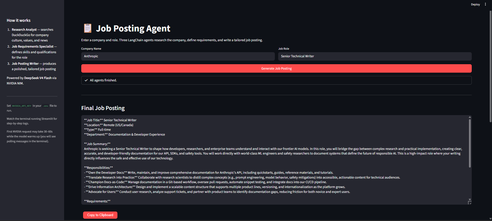

# Job Posting Agent

> Generate tailored job postings from a company name and role using DeepSeek V4 Flash on NVIDIA NIM.

## Overview

Job Posting Agent is a Streamlit app that turns a company name and job title into a complete, professional job posting. Three LangChain agents run in sequence: a Research Analyst gathers company context, a Job Requirements Specialist defines role skills and qualifications, and a Job Posting Writer produces the final posting. Results appear in expandable research and requirements sections, with the full posting ready to copy.

**Example input:** Company `Anthropic` · Role `Senior Technical Writer`

## Demo



## Features

- Simple Streamlit form for company name and job role
- Sequential multi-agent pipeline (research → requirements → job posting)
- Company culture and values research via web search
- Role-specific technical and soft skill requirements
- Polished job posting with summary, responsibilities, requirements, and apply instructions
- Expandable **Company Research** and **Role Requirements** sections
- **Copy to Clipboard** button for the final posting

## Tech Stack

| Layer | Technology |
|-------|------------|
| Agent orchestration | LangChain |
| LLM | [DeepSeek V4 Flash](https://build.nvidia.com/deepseek-ai/deepseek-v4-flash) (`deepseek-ai/deepseek-v4-flash`) via NVIDIA NIM |
| Web search | DuckDuckGo (`ddgs`) via `langchain-community` |
| UI | Streamlit |
| API base URL | `https://integrate.api.nvidia.com/v1` |

## Prerequisites

- Python 3.11 or later
- [NVIDIA API key](https://build.nvidia.com/) (starts with `nvapi-`)
- Internet access for NVIDIA NIM and DuckDuckGo search

## Installation

Clone the repository and open the project directory:

```bash
git clone https://github.com/Sumanth077/Hands-On-AI-Engineering.git
cd Hands-On-AI-Engineering/ai_agents/job-posting-agent
```

**Windows**

```bash
py -m venv .venv
.\.venv\Scripts\Activate.ps1
pip install -r requirements.txt
```

**macOS / Linux**

```bash
python3 -m venv .venv
source .venv/bin/activate
pip install -r requirements.txt
```

Copy the example environment file and add your API key:

```bash
cp .env.example .env
```

## Usage

1. Set `NVIDIA_API_KEY` in `.env` (see [Environment Variables](#environment-variables)).
2. Start the app:

```bash
streamlit run app.py
```

3. Enter a company and role (e.g. **Anthropic**, **Senior Technical Writer**).
4. Click **Generate Job Posting** and wait for the pipeline to finish.

> **Note:** The first request on the NVIDIA NIM free tier may take **30–60 seconds** while the model warms up. Later requests are usually faster.

## Environment Variables

| Variable | Required | Description |
|----------|----------|-------------|
| `NVIDIA_API_KEY` | Yes | API key from [NVIDIA Build](https://build.nvidia.com/). Used to call DeepSeek V4 Flash on NVIDIA NIM. |

Example `.env`:

```env
NVIDIA_API_KEY=nvapi-your-key-here
```

## Project Structure

```text
job-posting-agent/
├── app.py                 # Streamlit UI
├── nvidia_client.py       # NVIDIA NIM client (chat completions + polling)
├── config.py              # Configuration helpers
├── prompts.py             # Agent system prompts
├── agents/
│   ├── __init__.py
│   └── pipeline.py        # Multi-step agent orchestration
├── scripts/
│   └── test_nvidia.py     # Optional API connectivity test
├── assets/
│   └── demo.png           # Screenshot for README
├── requirements.txt
├── .env.example
└── README.md
```
