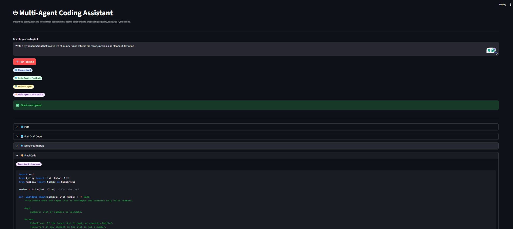

# Multi-Agent Coding Assistant

> A Streamlit app where three specialized AI agents collaborate to plan, write, review, and refine Python code from a single natural-language task description.

## Overview

Multi-Agent Coding Assistant orchestrates a four-stage pipeline powered by Mistral AI. You describe what you want built; a Planner Agent structures the approach, a Coder Agent writes the first draft, a Reviewer Agent critiques it for bugs and improvements, and the Coder Agent produces a polished final version. All four stages are surfaced in an expandable Streamlit UI so you can inspect every step of the process.

## Demo



**Example task:** *"Build a Python function that reads a CSV file and returns a dictionary of summary statistics (mean, median, std dev, min, max) for each numeric column."*

**What you get:**
- A structured implementation plan with function signatures and edge cases
- A typed, documented first-draft implementation
- A line-by-line code review covering bugs, performance, and best practices
- A corrected final version with all reviewer feedback applied

## Features

- **Planner Agent** — breaks any coding task into a numbered, step-by-step implementation plan
- **Coder Agent (Draft)** — translates the plan into typed, documented Python code
- **Reviewer Agent** — audits the draft for bugs, edge cases, PEP 8 compliance, performance, and security issues
- **Coder Agent (Final)** — applies every piece of reviewer feedback to produce production-ready code
- Expandable result sections so you can compare draft vs. final side by side
- Inline API key input as a fallback when no `.env` file is present

## Tech Stack

| Layer | Technology |
|---|---|
| LLM | Mistral Small 4 (`mistral-small-latest`) via Mistral AI API |
| Agent Framework | LangChain (`langchain-mistralai`, `langchain-core`) |
| UI | Streamlit |
| Environment | python-dotenv |

## Prerequisites

- Python 3.9 or higher
- A [Mistral AI API key](https://platform.mistral.ai)

## Installation

**1. Clone the repository**

```bash
git clone https://github.com/Sumanth077/Hands-On-AI-Engineering.git
cd Hands-On-AI-Engineering/ai_agents/multi_agent_coding_assistant
```

**2. Create and activate a virtual environment**

*Windows*
```bash
python -m venv .venv
.venv\Scripts\activate
```

*macOS / Linux*
```bash
python -m venv .venv
source .venv/bin/activate
```

**3. Install dependencies**

```bash
pip install -r requirements.txt
```

**4. Configure environment variables**

```bash
cp .env.example .env
```

Open `.env` and add your Mistral API key (see [Environment Variables](#environment-variables)).

## Usage

```bash
streamlit run app.py
```

Open `http://localhost:8501` in your browser, describe a coding task, and click **Run Pipeline**.

## Environment Variables

| Variable | Description |
|---|---|
| `MISTRAL_API_KEY` | Your Mistral AI API key — obtain one at [platform.mistral.ai](https://platform.mistral.ai) |

If `MISTRAL_API_KEY` is not set, the app will prompt you to paste it directly in the UI.

## Project Structure

```text
multi-agent-coding-assistant/
├── app.py               # Streamlit UI and pipeline orchestration
├── agents.py            # LLM setup and agent prompt/invocation logic
├── requirements.txt     # Python dependencies
├── .env.example         # Environment variable template
└── assets/
    └── demo.png         # App screenshot
```
