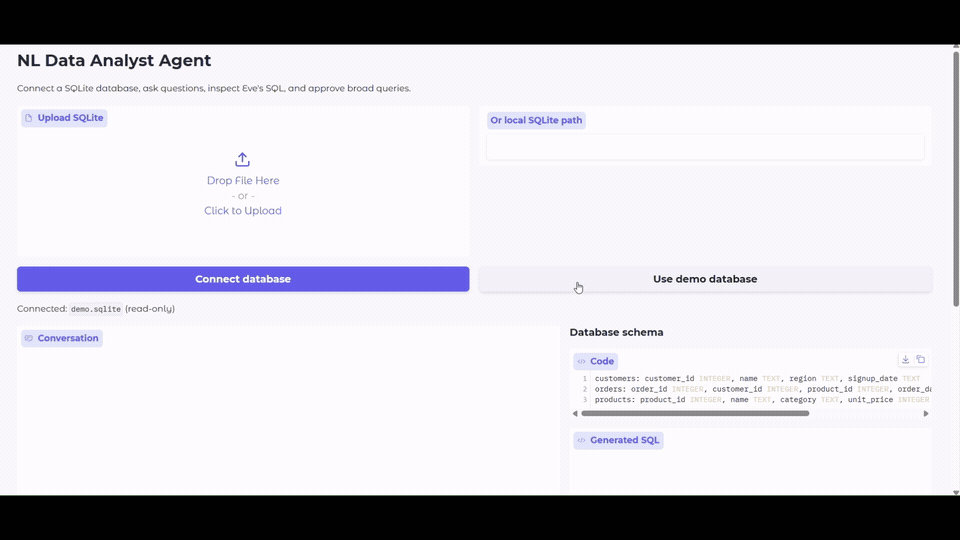

# Natural Language Data Analyst Agent

An analyst built with [Vercel Eve](https://github.com/vercel/eve) that lets you ask questions about a SQLite database in plain English. You describe the analysis you need instead of writing SQL yourself. The agent writes read-only SQL, shows the results, and asks for approval before broad queries run.



## What We Are Building

Connect a SQLite file in Gradio by uploading it, entering its local path, or loading the included sales example. Ask a question, and the Eve agent inspects the database schema, writes a SQL query, runs it through a read-only tool, and explains the returned rows. The model is `alibaba/qwen3.8-omni-flash` through Vercel AI Gateway. Gradio keeps the conversation, SQL, and result table together so you can inspect how the answer was produced.

The included sales example contains fictional customers, products, and orders from 2025. In this dataset, revenue is `quantity * unit_price` for completed orders. When you connect your own database, the agent uses its schema without assuming the same revenue definition.

Eve's SQL tool pauses for approval when a query has no `WHERE` clause. You can review the proposed SQL in Gradio, then approve or reject it before the query runs.


## Tech Stack

| Component | Choice |
| --- | --- |
| Agent runtime and approval | Vercel Eve `0.63.0` |
| Model gateway | Vercel AI Gateway |
| Exact model | `alibaba/qwen3.8-omni-flash` |
| Agent tools | TypeScript, Zod, Node SQLite |
| Interface | Gradio |
| Data | SQLite |
| Python packages | uv |
| Node packages | pnpm |

## Prerequisites

- Node.js 24 or newer, because this Eve release requires Node 24.
- pnpm, Python 3.10 or newer, and [uv](https://docs.astral.sh/uv/getting-started/installation/).
- A [Vercel AI Gateway](https://vercel.com/docs/ai-gateway) API key with access to `alibaba/qwen3.8-omni-flash`. Gateway model requests incur usage charges.
- Internet for package installation, Eve model metadata at build time, and model requests.

On Windows, run the commands below in a VS Code PowerShell terminal opened in this project folder. From the repository root:

```powershell
cd ai_agents/nl_data_analyst_agent
```

If needed, install uv and pnpm first, then open a new terminal:

```powershell
winget install --id=astral-sh.uv -e
npm install -g pnpm
```

## Setup

```powershell
Copy-Item .env.example .env
pnpm install
uv sync
```

Edit `.env` and set `AI_GATEWAY_API_KEY` to your own key. Never commit this file. `EVE_URL` defaults to `http://127.0.0.1:3000`. You can optionally set `DATABASE_PATH` to prefill the path control in Gradio. Leave `GRADIO_SERVER_NAME=127.0.0.1` for local use.

The demo button seeds the example database automatically. To seed it in advance:

```powershell
uv run python seed_data.py
```

## Run

Use two PowerShell terminals in this folder. In terminal 1, start Eve:

```powershell
pnpm run dev
```

The local launcher builds Eve, then starts it on loopback port 3000 with Eve's local-development authentication enabled. Wait for it to report that it is listening. In terminal 2, start Gradio:

```powershell
uv run python main.py
```

Open [http://127.0.0.1:7860](http://127.0.0.1:7860). Click **Use demo database**, or upload your own SQLite file and click **Connect database**. Ask one of the suggested questions. The answer appears beside the SQL and result rows. For a query without a `WHERE` clause, review the SQL and use **Approve query** or **Reject query** to continue.

Try these demo questions:

- Which region had the most completed-order revenue in 2025?
- What were monthly completed-order revenues in 2025?
- Show the first 20 orders with customer and product names.

The last question demonstrates the approval controls. You can also say “Hi” to start the conversation.

## Safety and Scope

The SQL tool accepts one `SELECT`, opens SQLite read-only, and enables query-only mode. Queries returning more than 200 rows are rejected with a prompt to add aggregation or `LIMIT`. Eve requests approval before executing queries without a `WHERE` clause. This rule catches broad queries but does not estimate their cost.

This project runs locally with SQLite files. To deploy it for other users or connect a production database, add authentication, access controls, and stronger query limits. Database paths are stored in the ignored `data/connections.json` file. Keep database files containing sensitive data and `.env` out of Git.

## Developer Checks

The commands below are optional checks, not steps required to open the UI:

```powershell
pnpm run build
uv run --extra dev python -m pytest -q
```

The GIF above shows the working Gradio application.

## Project Structure

```text
nl_data_analyst_agent/
├── agent/
│   ├── agent.ts             # Eve model configuration
│   ├── instructions.md      # Analyst behavior
│   ├── lib/database.ts      # SQLite access and SQL checks
│   └── tools/              # Eve schema and query tools
├── main.py                 # Gradio client for Eve sessions
├── seed_data.py            # Fictional demo database
├── tests/                 # Offline UI checks
├── assets/how_it_works.png
├── package.json
├── pnpm-lock.yaml
├── pyproject.toml
└── .env.example
```

## Resources

[Eve documentation](https://eve.dev/docs) · [Eve HTTP sessions](https://github.com/vercel/eve/blob/main/docs/channels/eve.mdx) · [Eve human approval](https://github.com/vercel/eve/blob/main/docs/tutorial/guard-the-spend.mdx) · [Vercel AI Gateway](https://vercel.com/docs/ai-gateway) · [Gradio documentation](https://www.gradio.app/docs)
