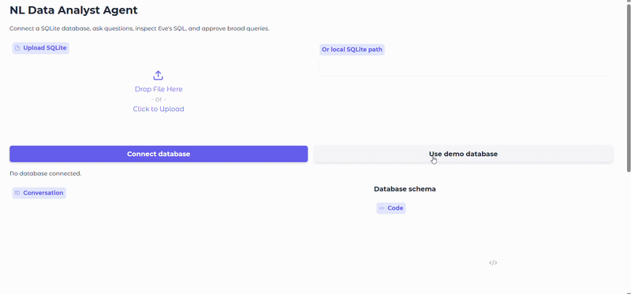

# Natural Language Data Analyst Agent

An analyst built with [Vercel Eve](https://github.com/vercel/eve) that lets you ask questions about a SQLite database in plain English. You describe the analysis you need instead of writing SQL yourself. The agent writes read-only SQL, shows the results, and asks for approval before broad queries run. [Jev](https://vercel.com/ai-gateway/models/jev) reviews question clarity, SQL relevance, and answer grounding without replacing Qwen as the SQL or explanation writer.



## What We Are Building

Connect a SQLite file in Gradio by uploading it, entering its local path, or loading the included sales example. Ask a question, and the Eve agent inspects the database schema, writes a SQL query, runs it through a read-only tool, and explains the returned rows. The model is `alibaba/qwen3.8-omni-flash` through Vercel AI Gateway. Gradio keeps the conversation, SQL, and result table together so you can inspect how the answer was produced.

The included sales example contains fictional customers, products, and orders from 2025. In this dataset, revenue is `quantity * unit_price` for completed orders. When you connect your own database, the agent uses its schema without assuming the same revenue definition.

Eve's SQL tool pauses for approval when a query has no `WHERE` clause. You can review the proposed SQL in Gradio, then approve or reject it before the query runs. Gradio associates proposed SQL, results, and approvals by Eve call ID, so an approval prompt always shows its own SQL and never displays rows returned by a different call. If another call completed in the same turn, those results are hidden during review and can be restored after rejection with an explicit label.

Jev makes narrow, structured judgments with confidence values at three interception points:

1. Before Gradio sends a question to Eve, Jev sees the selected schema and known demo metric definition. A confident missing-definition judgment asks the user to clarify; clear questions proceed.
2. After Qwen proposes SQL, `run_sql` sends Jev the authoritative question bound from Eve's `message.received` event, plus the schema and validated SQL, before database execution. Qwen cannot supply or rewrite the reviewed question. A confident mismatch with a specific issue returns a structured review to Eve without running the query, giving Eve one revision attempt.
3. After SQLite returns rows and Eve completes its explanation, Gradio sends Jev the question, executed SQL, rows, and explanation before displaying it. A confident grounding mismatch is presented as an **unverified draft awaiting user review**, ahead of Eve's text, with an exact follow-up prompt for revision. The SQL and rows remain visible for comparison.

The default confidence threshold is `0.70`. Low-confidence judgments, inconsistent verdict/issue pairs, and Jev API failures fail open for availability and are displayed as reviewer notes. A mismatch without a specific issue is treated as inconclusive rather than blocking. A non-mismatch verdict ignores a contradictory issue label. These outcomes never relax SQL validation, approve a query, or bypass human approval. Jev is a reviewer only; Qwen continues to generate SQL and prose.


## Tech Stack

| Component | Choice |
| --- | --- |
| Agent runtime and approval | Vercel Eve `0.63.0` |
| Model gateway | Vercel AI Gateway |
| Exact model | `alibaba/qwen3.8-omni-flash` |
| Structured reviewer | `typesafe-ai/jev` |
| Agent tools | TypeScript, Zod, Node SQLite |
| Interface | Gradio |
| Data | SQLite |
| Python packages | uv |
| Node packages | pnpm |

## Prerequisites

- Node.js 24 or newer, because this Eve release requires Node 24.
- pnpm, Python 3.10 or newer, and [uv](https://docs.astral.sh/uv/getting-started/installation/).
- A [Vercel AI Gateway](https://vercel.com/docs/ai-gateway) API key with access to `alibaba/qwen3.8-omni-flash`. Gateway model requests incur usage charges.
- Internet for package installation, Eve model metadata at build time, and model requests.

On Windows, run the commands below in a VS Code PowerShell terminal opened in this project folder. From the repository root:

```powershell
cd ai_agents/nl_data_analyst_agent
```

If needed, install uv and pnpm first, then open a new terminal:

```powershell
winget install --id=astral-sh.uv -e
npm install -g pnpm
```

## Setup

```powershell
Copy-Item .env.example .env
pnpm install
uv sync
```

Edit `.env` and set `AI_GATEWAY_API_KEY` to your own key. The same Vercel AI Gateway key is used by Eve/Qwen and all three Jev reviews. Never commit this file. `EVE_URL` defaults to `http://127.0.0.1:3000`. You can optionally set `DATABASE_PATH` to prefill the path control in Gradio. Leave `GRADIO_SERVER_NAME=127.0.0.1` for local use.

Reviewer settings are optional:

```dotenv
JEV_MODEL=typesafe-ai/jev
JEV_MIN_CONFIDENCE=0.70
JEV_TIMEOUT_SECONDS=10
JEV_URL=https://ai-gateway.vercel.sh/v1/evaluate
```

`JEV_URL` is used by the Python/Gradio checks. Those checks read reviewer settings when each request runs, after `.env` has loaded. Eve's TypeScript `evaluate` helper resolves `JEV_MODEL` through its configured AI Gateway connection. Raise the confidence threshold after calibrating the three judgments on representative questions. If credentials or Jev are unavailable, the app continues and adds a visible “review unavailable” note.

The demo button seeds the example database automatically. To seed it in advance:

```powershell
uv run python seed_data.py
```

## Run

Use two PowerShell terminals in this folder. In terminal 1, start Eve:

```powershell
pnpm run dev
```

The local launcher builds Eve, then starts it on loopback port 3000 with Eve's local-development authentication enabled. Wait for it to report that it is listening. In terminal 2, start Gradio:

```powershell
uv run python main.py
```

Open [http://127.0.0.1:7860](http://127.0.0.1:7860). Click **Use demo database**, or upload your own SQLite file and click **Connect database**. Ask one of the suggested questions. The answer appears beside the SQL and result rows. For a query without a `WHERE` clause, review the SQL and use **Approve query** or **Reject query** to continue.

Try these demo questions:

- Which region had the most completed-order revenue in 2025?
- What were monthly completed-order revenues in 2025?
- Show the first 20 orders with customer and product names.

The last question demonstrates the approval controls. You can also say “Hi” to start the conversation.

## Safety and Scope

The SQL tool accepts one `SELECT`, opens SQLite read-only, and enables query-only mode. Queries returning more than 200 rows are rejected with a prompt to add aggregation or `LIMIT`. Eve requests approval before executing queries without a `WHERE` clause. This rule catches broad queries but does not estimate their cost. These deterministic controls run independently of Jev. A Jev result cannot authorize SQL, change permissions, override rejection, or answer an approval request.

The SQL relevance check is inside `run_sql`, immediately before statement execution. Eve's stream exposes `actions.requested` before execution, but Gradio consuming that event cannot reliably cancel the server-side tool call. Placing the gate in the tool is therefore the smallest sound interception point. An Eve hook captures the exact Gradio message from the durable `message.received` event and stores its database ID, question, and turn ID in per-session state. `run_sql` accepts no question field and refuses an unbound database or turn, so the model cannot substitute the text Jev reviews.

This project runs locally with SQLite files. To deploy it for other users or connect a production database, add authentication, access controls, and stronger query limits. Database paths are stored in the ignored `data/connections.json` file. Keep database files containing sensitive data and `.env` out of Git.

## Developer Checks

The commands below are optional checks, not steps required to open the UI:

```powershell
pnpm run build
pnpm test
uv run --extra dev python -m pytest -q
```

All automated Jev tests use mocked evaluator responses and require no API key or paid model call. A live end-to-end run still requires an AI Gateway key with access to both configured models.

The GIF above shows the working Gradio application.

## Project Structure

```text
nl_data_analyst_agent/
├── agent/
│   ├── agent.ts             # Eve model configuration
│   ├── instructions.md      # Analyst behavior
│   ├── hooks/capture_question.ts # Bind authoritative questions to Eve turns
│   ├── lib/database.ts      # SQLite access and SQL checks
│   ├── lib/jev.ts           # Pre-execution SQL relevance review
│   ├── lib/question_context.ts # Per-session question binding
│   └── tools/              # Eve schema and query tools
├── main.py                 # Gradio client for Eve sessions
├── jev_review.py           # Question and answer Jev reviews
├── seed_data.py            # Fictional demo database
├── tests/                 # Offline UI checks
├── assets/demo.gif          # Gradio application demo
├── package.json
├── pnpm-lock.yaml
├── pyproject.toml
└── .env.example
```

## Resources

[Jev through AI SDK and Eve](https://vercel.com/i/jev-integrations) · [Jev on AI Gateway](https://vercel.com/ai-gateway/models/jev) · [Eve evaluation](https://github.com/vercel/eve/blob/main/docs/guides/evaluate.md) · [Eve sessions and stream events](https://github.com/vercel/eve/blob/main/docs/concepts/sessions-runs-and-streaming.md) · [Eve human approval](https://github.com/vercel/eve/blob/main/docs/tutorial/guard-the-spend.mdx) · [Gradio documentation](https://www.gradio.app/docs)
