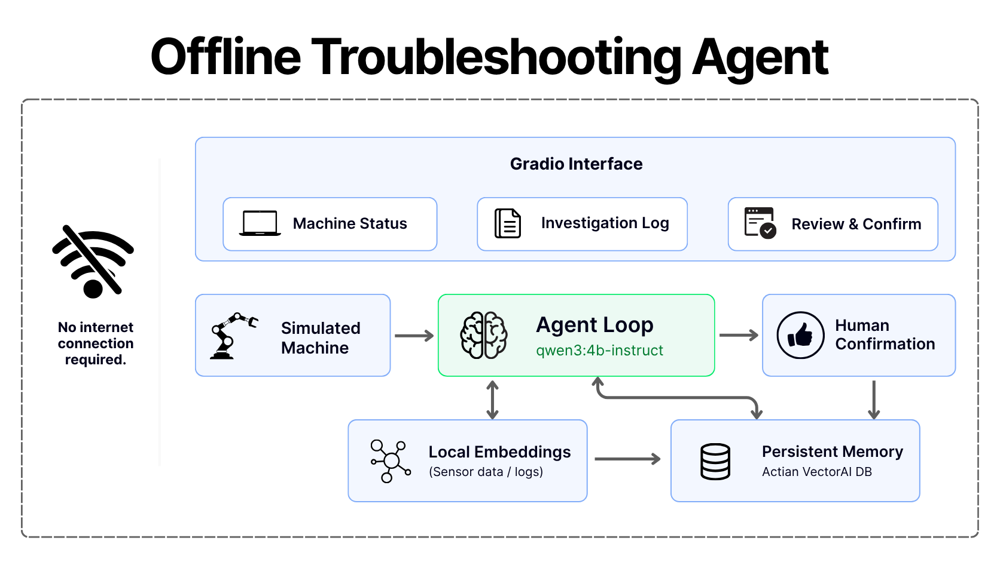
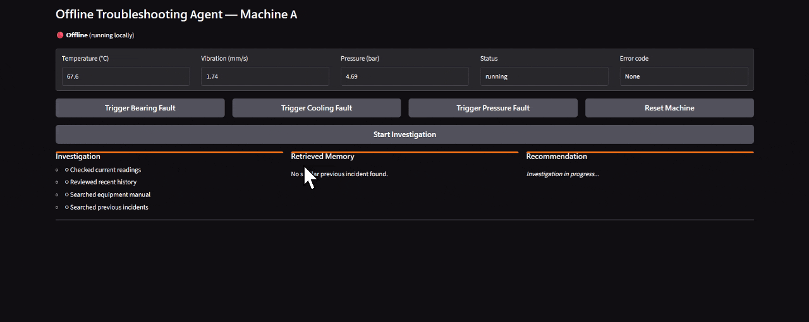

# Offline Troubleshooting Agent
> A local AI maintenance assistant that keeps its memory even when the internet doesn't.

## Overview
The Offline Troubleshooting Agent is a fully local AI maintenance assistant for a simulated industrial machine. It investigates simulated sensor faults using a local LLM, a local equipment manual, and a local vector memory of previously resolved incidents, then requires a human technician to confirm or correct its diagnosis before anything is saved. Everything, the model, the embeddings, and the memory store, runs on a single machine, so the agent keeps working and keeps remembering even with the network fully disconnected.

## How It Works

The agent investigates a fault using only local tools, current sensor readings, the equipment manual, and past resolved incidents, before any human ever reviews the case. Once it concludes, it proposes a diagnosis but never writes it to persistent memory itself; a human technician has to confirm or correct that diagnosis first, and only that confirmation step commits anything to the durable incident store.

## Demo

See `docs/OFFLINE_TEST_LOG_20260923T092644.md` for a real completed offline run, actual proof of the offline claim, not just the diagram's word for it.

## Features
- Simulates three distinct machine fault types (bearing wear, cooling failure, pressure loss) with realistic sensor trends
- Investigates faults using a local LLM (qwen3:4b-instruct via Ollama) with a small, auditable tool set
- Retrieves relevant equipment manual sections and prior resolved incidents from a local vector database
- Distinguishes current sensor evidence from retrieved past incidents instead of blindly trusting either one
- Requires human confirmation before any diagnosis is written to permanent memory, and preserves the model's original diagnosis separately from the human's confirmed cause
- Persists incidents across application restarts and Actian container restarts
- Proven to work with the network fully disconnected, verified by an automated offline test with a built in connectivity guard
- Ships with automated tests covering the simulator, memory layer, agent tools, agent behavior, and safety boundaries

## Tech Stack
| Layer | Technology |
|-------|------------|
| LLM | Ollama running qwen3:4b-instruct |
| Embeddings | Ollama running nomic-embed-text |
| Vector Memory | Actian VectorAI DB |
| UI | Gradio |
| Data handling | Pandas |
| Schema validation | Pydantic |

## Prerequisites
- Python 3.10 or higher
- Docker Desktop
- Ollama installed, with:
  - [ ] qwen3:4b-instruct pulled (`ollama pull qwen3:4b-instruct`)
  - [ ] nomic-embed-text pulled (`ollama pull nomic-embed-text`)

No API keys or cloud accounts are needed anywhere in this project. It is fully local.

## Installation
### 1. Clone the Repository
```bash
git clone https://github.com/Sumanth077/Hands-On-AI-Engineering.git
cd Hands-On-AI-Engineering/ai_agents/offline_troubleshooting_agent
```

### 2. Start Actian VectorAI DB
```bash
docker compose up -d
```
This starts the container on host ports 6673 to 6675 instead of the image's default 6573 to 6575, so it will not collide with another Actian based project that might already be running on the same machine.

### 3. Create a Virtual Environment
This project uses its own `.venv` because installing `actian-vectorai-client` pulled in a `protobuf` version that conflicted with other tooling already installed on the development machine (see `docs/BUILD_LOG.md`, step 5). An isolated environment avoids that conflict entirely.
```bash
python -m venv .venv
```

### 4. Activate the Virtual Environment
macOS/Linux:
```bash
source .venv/bin/activate
```
Windows PowerShell:
```powershell
.venv\Scripts\Activate.ps1
```
Windows CMD:
```cmd
.venv\Scripts\activate.bat
```

### 5. Install Dependencies
```bash
pip install -r requirements.txt
```

### 6. Configure Environment Variables
```bash
cp .env.example .env
```
Fill in the Actian fields to match the port mapping from step 2. See Environment Variables below for the full list.

### 7. Seed Demo Data
```bash
python scripts/seed_memory.py --mode seeded
```
This ingests the local equipment manual and loads a few demo incidents, so the first investigation already has prior experience to retrieve.

## Environment Variables
| Variable | Description | Where to Get It |
|----------|--------------|------------------|
| OLLAMA_BASE_URL | URL of the local Ollama server | Runs locally, no account needed |
| OLLAMA_MODEL | Local model used for the agent loop | Runs locally, no account needed. Pull with `ollama pull qwen3:4b-instruct` |
| EMBEDDING_MODEL | Local model used for embeddings | Runs locally, no account needed. Pull with `ollama pull nomic-embed-text` |
| ACTIAN_VECTORAI_HOST | Host for the local Actian VectorAI DB container | Runs locally, no account needed |
| ACTIAN_VECTORAI_PORT | Port for the local Actian VectorAI DB container | Runs locally, no account needed |
| ACTIAN_VECTORAI_INCIDENT_COLLECTION | Collection name for resolved incidents | Runs locally, no account needed |
| ACTIAN_VECTORAI_MANUAL_COLLECTION | Collection name for manual chunks | Runs locally, no account needed |
| GRADIO_SERVER_NAME | Host the Gradio app binds to | Runs locally, no account needed |
| GRADIO_SERVER_PORT | Port the Gradio app binds to | Runs locally, no account needed |

Unlike most projects in this repo, every one of these runs entirely on your own machine. There is nothing here to sign up for.

## Usage
### Run the App
```bash
python app.py
```
Comes up at `http://127.0.0.1:7860` (configurable via GRADIO_SERVER_NAME and GRADIO_SERVER_PORT). Trigger a fault from the Machine Status panel, click Start Investigation, and watch the Investigation, Retrieved Memory, and Recommendation panels fill in as the agent works. Once it concludes, a Review & Confirm panel appears with the model's diagnosis pre filled and fully editable. Click Confirm & Save to Memory to write it as a durable incident, or Discard to throw the investigation away without saving anything.

### The Persistence Test
Proves a saved incident survives a real Actian container restart.
```bash
python scripts/persistence_test.py --mode save
docker compose restart offline-troubleshooting-vectorai
python scripts/persistence_test.py --mode verify
```
`--mode verify` runs as a separate process and passes only if every field of the saved marker incident matches exactly and it is retrievable both by direct id lookup and by semantic search.

### The Offline Test
This is the actual point of the project. Everything else proves the pieces work. This test proves the real claim: a real local investigation can recall a genuinely new incident with zero internet access.

`scripts/offline_test.py` triggers a bearing fault, runs a full investigation, and checks by exact incident id whether it recalls a reference incident that was saved earlier while still online. Before anything else runs, the script needs the network physically disconnected, and it enforces that itself: it first attempts a short timeout TCP connection to a public address, and if that connection succeeds, the network is not actually disconnected, so it prints a loud warning and exits immediately rather than letting the test silently pass under the wrong conditions. This guard exists specifically to keep the result honest.

To run it for real:
1. Physically disconnect the network (turn off Wi-Fi or unplug the cable).
2. In a terminal, run:
```bash
python scripts/offline_test.py
```
3. Reconnect the network once it finishes.

Results are written to a timestamped file under `docs/OFFLINE_TEST_LOG_<timestamp>.md`, so they survive even if the terminal closes before reconnecting.

### Resetting the Demo
```bash
python scripts/reset_demo.py
python scripts/reset_demo.py --reseed
```
The first clears the incidents collection. The second clears it and then reloads the demo incidents from `data/seed_incidents.json`. Neither touches the simulator's live machine state, use the Reset Machine button in the UI for that.

## Project Structure
```
offline_troubleshooting_agent/
├── README.md
├── requirements.txt
├── .env.example
├── docker-compose.yml
├── app.py
│
├── agent/
│   ├── confirmation.py
│   ├── harness.py
│   ├── llm_client.py
│   ├── prompts.py
│   ├── state.py
│   └── tools.py
│
├── simulator/
│   ├── machine.py
│   ├── scenarios.py
│   └── history.py
│
├── memory/
│   ├── vectorai_client.py
│   ├── embeddings.py
│   ├── manual.py
│   └── incident_store.py
│
├── documents/
│   ├── machine_manual.md
│   └── troubleshooting_guide.md
│
├── data/
│   └── seed_incidents.json
│
├── models/
│   └── schemas.py
│
├── ui/
│   └── gradio_app.py
│
├── scripts/
│   ├── seed_memory.py
│   ├── reset_demo.py
│   ├── persistence_test.py
│   ├── offline_test.py
│   ├── maintenance_rebuild_index.py
│   └── check_*.py
│
├── docs/
│   ├── BUILD_LOG.md
│   └── PROJECT_REFERENCE.md
│
└── tests/
    ├── test_simulator.py
    ├── test_tools.py
    ├── test_agent.py
    ├── test_confirmation.py
    ├── test_safety.py
    └── test_*.py
```

## Limitations
This is a simulated machine and a fictional equipment manual, not a certified safety system. `qwen3:4b-instruct` is a small local model and occasionally needs the harness's retry nudge or fallback logic rather than concluding cleanly on the first attempt. Actian VectorAI DB Community Edition has a known behavior where a collection needs to be explicitly reopened after a restart before it is queryable again. This project handles that automatically inside `ensure_collection()`.

## Safety Note
This is a simulation and demo assistant, not a certified industrial safety system. It recommends inspection and normal maintenance procedure, never instructs bypassing safety interlocks or alarms, and never directly controls machinery.

## License
MIT

---
[⬆ Back to Top](#offline-troubleshooting-agent)
