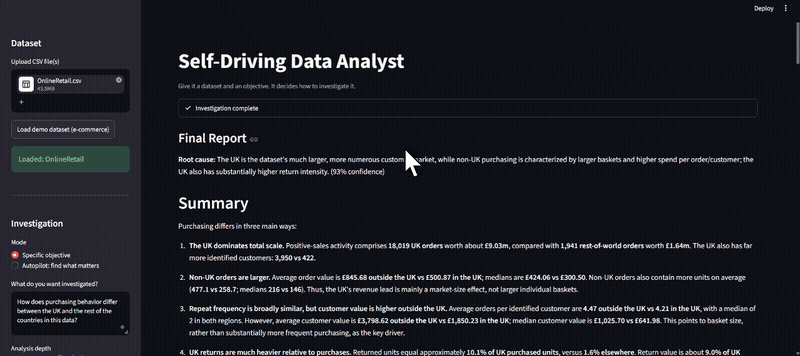

# Self-Driving Data Analyst with Liner
> An AI agent that investigates a dataset on its own, without requiring the user to guide every step.

## Overview
Give it a dataset and a broad objective, "why did revenue decline?", and it decides what to check, runs the analysis, follows what it finds, and keeps going until it has enough evidence to explain what happened. Built on the Liner Model API (`liner-mark-1.0`), which automatically routes each request to the most cost-efficient underlying model for that request, so a multi-step agent making dozens of calls per investigation isn't paying premium-model prices for the easy steps.

## Demo


## Features
- Autonomous investigation loop: understand data, choose what to check, run analysis, observe, decide next step, repeat, produce findings
- Hypothesis tracking with status and confidence, updated as evidence comes in
- Parallel tool calls for independent lines of investigation (e.g. checking product, region, and channel at once)
- Error recovery: a failed SQL query becomes an observation the agent reasons over, not a crash
- Loop detection: flags and redirects the agent if it repeats near-identical queries with no new information
- Structured final report (root cause, confidence, key findings, recommended actions) via a dedicated `finish_investigation` tool
- Full usage and cost tracking per investigation, including cached-token savings

## Tech Stack
| Layer | Technology |
|-------|------------|
| LLM | Liner Model API (`liner-mark-1.0`) |
| Agent orchestration | Custom Python investigation loop (`agent/harness.py`) |
| Data processing | Pandas |
| SQL analysis | DuckDB |
| Charts | Plotly |
| UI | Streamlit |
| Structured state | Pydantic |

## Prerequisites
- Python 3.10 or higher
- API keys for:
  - Liner (https://liner.com/developers)

## Installation

### 1. Clone the repository
```bash
git clone https://github.com/Sumanth077/Hands-On-AI-Engineering.git
cd Hands-On-AI-Engineering/ai_agents/self_driving_data_analyst
```

### 2. Create a virtual environment
```bash
python -m venv .venv
```

### 3. Activate the virtual environment

**macOS / Linux**
```bash
source .venv/bin/activate
```

**Windows (PowerShell)**
```powershell
.\.venv\Scripts\Activate.ps1
```

**Windows (Command Prompt)**
```cmd
.venv\Scripts\activate.bat
```

### 4. Install dependencies
```bash
pip install -r requirements.txt
```

### 5. Configure environment variables
```bash
cp .env.example .env
```
Open `.env` and add your Liner API key.

## Environment Variables
| Variable | Description | Where to Get It |
|----------|-------------|------------------|
| LINER_API_KEY | Authenticates requests to the Liner Model API | Liner Developer Dashboard (liner.com/developers) |

## Usage

### Run the app
```bash
python scripts/generate_sample_data.py   # generates the demo dataset, first time only
streamlit run app.py
```

### Example objectives
| Objective | What it does |
|-----------|---------------|
| "Why did revenue decline?" | Investigates a specific question end to end |
| "Find the most important patterns in this data" | Autopilot mode, open-ended exploration |
| "Why do returns spike in certain months?" | Works against uploaded real-world datasets too, not just the demo one |

### What the agent returns
A structured report: root cause with a confidence score, key findings with supporting evidence, hypotheses it tested along the way, relevant charts, recommended next steps, and a full usage breakdown (model calls, tool calls, tokens, estimated cost).

## Project Structure

```
self_driving_data_analyst/
├── app.py                       # Streamlit UI
├── agent/
│   ├── client.py                 # Liner Model API wrapper
│   ├── harness.py                 # the investigation loop
│   ├── state.py                   # Pydantic investigation state
│   ├── prompts.py                 # system prompt
│   ├── tool_schemas.py            # function-calling schemas
│   └── loop_detector.py
├── tools/
│   ├── dataset.py   sql.py   python_tool.py   charts.py   findings.py
├── scripts/
│   └── generate_sample_data.py   # builds the demo dataset
├── data/ecommerce_demo/          # generated CSVs (git-ignored, regenerate locally)
└── tests/                        # runs without a live API key (mocked client)
```


## How It Works

### The investigation loop

Understand the data -> Choose what to investigate -> Run an analysis ->
Observe the result -> Decide what to investigate next -> Repeat ->
Produce final findings

The result of each step determines the next one. There's no fixed pipeline telling it to check revenue, then orders, then AOV in that order, it decides that itself based on what it finds.

### The tools
| Tool | What it does |
|---|---|
| `inspect_dataset()` | Schema, column types, row counts, sample rows |
| `run_sql(query)` | Runs a DuckDB SQL query, returns rows or an error |
| `run_python(code)` | Runs Python for stats SQL isn't suited for |
| `create_chart(...)` | Renders a Plotly chart locally |
| `save_finding(...)` | Writes a discovery into persistent state |
| `update_hypothesis(...)` | Records a theory and its status (untested/supported/rejected) as evidence comes in |
| `finish_investigation(...)` | Concludes the investigation with a structured root cause, confidence, findings, and recommended actions |

There's no `find_root_cause()` tool, on purpose. That decision has to stay with the model, or the harness is doing the interesting part instead of it.

### State, not just chat history
Raw conversation history isn't enough to reason about a multi-step investigation. `agent/state.py` keeps an explicit `InvestigationState`: findings, hypotheses, tool-call history, and usage. Its `summary_for_prompt()` is what gets re-sent to the model each turn, a compact snapshot, not the full raw history, since older raw tool-call turns get pruned from what's sent while the structured summary carries that context forward instead.

### Failure recovery and loop detection
If a SQL query fails, the error is returned as data, not raised, and the system prompt tells the model to read the error and try again rather than giving up. Separately, if the agent runs near-identical queries repeatedly with no new information, the harness injects a message telling it to reassess.

### Stopping
The model concludes by calling `finish_investigation(...)` with its structured findings. As a fallback, if it ever responds with no further tool calls, that's also treated as a conclusion. Either way, `max_steps` and `max_tool_calls` (both configurable in the sidebar) put a hard ceiling on the loop so it can't run indefinitely.

### Cost visibility
Every response's usage, including cached tokens, is tracked across the whole investigation and shown at the end: steps, model calls, tokens, and an estimated cost using Liner's published `liner-mark-1.0` pricing, what you're actually billed regardless of which underlying model the orchestrator routed any given request to.

### A note on run_python
`run_python` executes model-generated code with a restricted builtins list and no filesystem/network access, a reasonable floor for a local demo but not a real security sandbox. For anything beyond your own machine or a trusted demo, run this tool inside a real sandbox (for example, E2B) instead of in-process.
