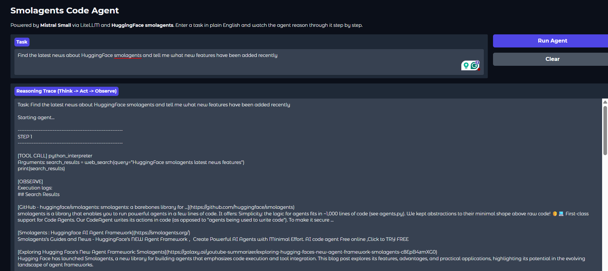

# Smolagents Code Agent

> A real-time AI agent that takes any natural language task, reasons through it with a think-act-observe loop, and streams every step live in a Gradio UI.

## Overview

<<<<<<< HEAD
Smolagents Code Agent wires together HuggingFace's **smolagents** `CodeAgent` and **Mistral Small** (via LiteLLM) into a Gradio web app. You type a task, the agent writes and executes Python code using DuckDuckGo and Wikipedia, and every reasoning step appears in the UI as it happens — no waiting for a final answer to see what the model was thinking.
=======
Smolagents Code Agent wires together HuggingFace's **smolagents** `CodeAgent` and **Mistral Small** (via LiteLLM) into a Gradio web app. You type a task, the agent writes and executes Python code using DuckDuckGo and Wikipedia, and every reasoning step appears in the UI as it happens. No waiting for a final answer to see what the model was thinking.
>>>>>>> 1d1e9f137cfd1123edbae5d8e955ce0b9c7fcf4a

## Demo



## Features

<<<<<<< HEAD
- **Real-time trace streaming** — every Think, Act, and Observe step appears in the UI as the agent works, powered by `step_callbacks` and a background thread queue
- **Code-first reasoning** — the agent writes and executes Python code at each step rather than calling fixed tool APIs
- **Two built-in tools** — `DuckDuckGoSearchTool` for live web search and a custom `WikipediaTool` that fetches 5-sentence article summaries
- **Clean final answer** — the agent's conclusion is extracted and displayed separately from the full reasoning trace
- **Swappable LLM** — change one line in `app.py` to switch from Mistral Small to DeepSeek V3 Flash via OpenRouter (see [Usage](#usage))
- **Run/Clear controls** — a spinner confirms the agent is active; Clear resets all outputs instantly
=======
- **Real-time trace streaming**: every Think, Act, and Observe step appears in the UI as the agent works, powered by `step_callbacks` and a background thread queue
- **Code-first reasoning**: the agent writes and executes Python code at each step rather than calling fixed tool APIs
- **Two built-in tools**: `DuckDuckGoSearchTool` for live web search and a custom `WikipediaTool` that fetches 5-sentence article summaries
- **Clean final answer**: the agent's conclusion is extracted and displayed separately from the full reasoning trace
- **Swappable LLM**: change one line in `app.py` to switch from Mistral Small to DeepSeek V3 Flash via OpenRouter (see [Usage](#usage))
- **Run/Clear controls**: a spinner confirms the agent is active; Clear resets all outputs instantly
>>>>>>> 1d1e9f137cfd1123edbae5d8e955ce0b9c7fcf4a

## Tech Stack

| Layer | Technology |
|---|---|
<<<<<<< HEAD
| Agent framework | [HuggingFace smolagents](https://github.com/huggingface/smolagents) — `CodeAgent` |
=======
| Agent framework | [HuggingFace smolagents](https://github.com/huggingface/smolagents) (`CodeAgent`) |
>>>>>>> 1d1e9f137cfd1123edbae5d8e955ce0b9c7fcf4a
| LLM | Mistral Small 4 (`mistral-small-latest`) via `LiteLLMModel` |
| Web search | `DuckDuckGoSearchTool` (bundled with smolagents) |
| Knowledge tool | Custom `WikipediaTool` using the `wikipedia` package |
| UI | [Gradio](https://www.gradio.app/) |

## Prerequisites

- Python 3.10 or later
<<<<<<< HEAD
- A Mistral API key — get one at [platform.mistral.ai](https://platform.mistral.ai)
=======
- A Mistral API key. Get one at [platform.mistral.ai](https://platform.mistral.ai)
>>>>>>> 1d1e9f137cfd1123edbae5d8e955ce0b9c7fcf4a

## Installation

**Clone the repository**

```bash
git clone https://github.com/Sumanth077/Hands-On-AI-Engineering.git
cd Hands-On-AI-Engineering/ai_agents/smolagents_code_agent
```

**Create and activate a virtual environment**

*Windows*
```bash
python -m venv .venv
.venv\Scripts\activate
```

*macOS / Linux*
```bash
python -m venv .venv
source .venv/bin/activate
```

**Install dependencies**

```bash
pip install -r requirements.txt
```

**Set up environment variables**

```bash
cp .env.example .env
```

Open `.env` and paste your Mistral API key (see [Environment Variables](#environment-variables)).

## Usage

```bash
python app.py
```

Open `http://127.0.0.1:7860` in your browser, type a task, and click **Run Agent**.

**Example task**

```text
Find the latest news about AI agents and summarize the top 3 stories.
```

## Environment Variables

| Variable | Description | Where to get it |
|---|---|---|
| `MISTRAL_API_KEY` | Authenticates requests to Mistral's API | [platform.mistral.ai](https://platform.mistral.ai) |

`.env.example`:

```env
MISTRAL_API_KEY=your_mistral_api_key_here
```

## Project Structure

```text
smolagents-code-agent/
├── app.py            # Gradio UI, agent runner, step formatter
├── tools.py          # Custom WikipediaTool
├── requirements.txt  # Python dependencies
├── .env              # Your secrets (git-ignored)
├── .env.example      # Template for .env
└── assets/
    └── demo.png      # Screenshot used in README
```
<<<<<<< HEAD
=======

[Back to Top](#smolagents-code-agent)
>>>>>>> 1d1e9f137cfd1123edbae5d8e955ce0b9c7fcf4a
