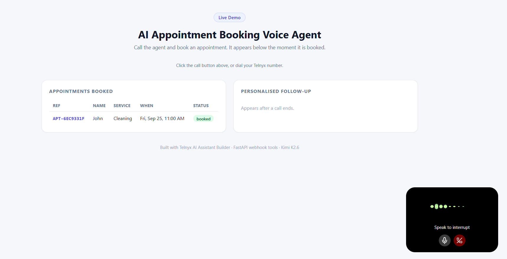
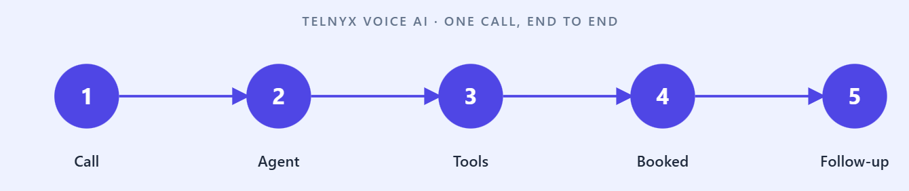

# AI Appointment Booking Voice Agent (Telnyx Voice AI)



*The live demo page: call the agent from the widget on the left, and watch the booking and the AI-written follow-up appear on the right as the call happens.*

A voice AI agent with a real phone number that books appointments over live phone
calls. The agent answers, qualifies the request, checks open slots, books the
appointment, generates a calendar invite, and stores a structured record in a
lightweight CRM dashboard. When the call ends, Telnyx Inference writes a
personalised follow-up message from the call summary.

Voice, telephony, tool calls, and inference all run on one platform, one API key.

## Overview

Telnyx runs the hard real-time parts in the portal: speech-to-text, the model,
text-to-speech, phone number routing, and conversation history. Your code owns
four things that have to be yours:

- The **live context** injected into the agent at the start of every call (today's
  date, business hours, services), via a Dynamic Variables webhook.
- The **tools** the scheduling agent calls: check availability and book an
  appointment. These are webhook tools that POST to this FastAPI server.
- The **calendar invite and CRM record** created when a booking succeeds.
- The **post-call follow-up**, drafted by Telnyx Inference and stored (and
  optionally texted back to the caller).

**What the Telnyx portal handles:** STT, LLM inference, TTS, phone number routing,
conversation history, and the post-call insight summary.

**What this code handles:** dynamic context, the booking tools, calendar invites,
the CRM dashboard, and the Inference-generated follow-up.

## How It Works



1. A caller dials the Telnyx number. The agent answers and, at call start, Telnyx
   calls the Dynamic Variables webhook so the agent knows today's date, the hours,
   and the service list.
2. The agent greets the caller, finds out which service they want and roughly when.
3. It calls the **check-availability** tool. Telnyx POSTs the date to this server,
   which returns open slots, and the agent offers a few out loud.
4. The caller picks a time. The agent calls the **book-appointment** tool. The
   server books the slot, writes a CRM record, and generates an `.ics` invite.
5. The agent confirms the booking reference out loud and ends the call.
6. Telnyx posts the call summary to the **call-summary** webhook. The server asks
   Telnyx Inference to draft a personalised follow-up, stores it, and optionally
   texts it to the caller. Everything shows up on the CRM dashboard.

## Tech Stack

| Layer | Tool |
|---|---|
| Voice and telephony | Telnyx Voice AI + a Telnyx phone number ($0.05/min bundled) |
| Agent | A single Telnyx AI Assistant with webhook tools |
| LLM | `moonshotai/Kimi-K2.6` via Telnyx (the recommended voice model) |
| Inference (follow-up) | Telnyx Inference, OpenAI-compatible endpoint, `moonshotai/Kimi-K2.6` |
| Tools and webhooks | FastAPI + Uvicorn |
| Calendar | Hand-rolled iCalendar (`.ics`), no dependency |
| CRM store and dashboard | SQLite + a single server-rendered HTML page |
| Package manager | uv |

## Prerequisites

- Python 3.10 or higher
- [uv](https://docs.astral.sh/uv/) (`pip install uv`)
- [ngrok](https://ngrok.com) to expose your local webhooks during development
- A [Telnyx account](https://portal.telnyx.com/sign-up) with a funded balance

## Telnyx Portal Setup

Everything below is done at [portal.telnyx.com](https://portal.telnyx.com). You
build **one** AI Assistant that handles the whole call. Start the FastAPI server
and ngrok first (see "Running" below) so you have your public URL ready, then
paste it where the steps say `https://YOUR-NGROK.ngrok.io`.

### Step 1: API key and phone number

1. Copy your **API Key** (starts with `KEY...`) from the API Keys page. Put it in
   `.env` as `TELNYX_API_KEY` (used for Inference and optional SMS).
2. Buy a phone number (a US local number is fine).

### Step 2: Create the assistant

- Left sidebar -> **AI Suite** -> **Assistants** -> **Create**. Start from a blank
  canvas (templates like Lead Qualification also exist).
- **Name:** `Appointment Agent`.
- **Model:** select `moonshotai/Kimi-K2.6` (the Recommended voice model in the
  dropdown). Only third-party models (OpenAI, etc.) need an API key here.
- **Instructions:**

```
You are the booking agent for {{business_name}}. Today is {{today_pretty}}.
Hours are {{business_hours}}. Services offered: {{services}}.

Keep replies under two sentences; callers are listening, not reading. Be warm
and efficient.

Handle the whole call:
1. Greet the caller and find out which service they want and roughly when.
2. Call check_availability with the date in YYYY-MM-DD format. Offer at most
   three of the returned times, spoken naturally.
3. When the caller picks a time, confirm their name, then call book_appointment
   with their name, the service, and the exact start value from the slot you
   offered.
4. Read back the booking reference and the day and time, then say a calendar
   invite and a text confirmation are on the way.

Never invent a time that check_availability did not return. If there are no slots,
offer another day. For a general question, answer briefly and offer to book.
```

- **Greeting:** `Thanks for calling {{business_name}}. How can I help you today?`
- Save.

### Step 3: Add the two webhook tools

Every assistant can already hang up. To add yours, in the assistant's **Tools**
area click the **"Add tool"** dropdown and choose **Webhook Tool**. Add two.

**Tool 1: check_availability**

- Name: `check_availability` (no spaces allowed)
- Description: `Return open appointment slots for a date. Send date as YYYY-MM-DD and optional service.`
- Method: `POST`
- Timeout (ms): `5000`
- URL: `https://YOUR-NGROK.ngrok.io/tools/check-availability`
- Add the model-filled arguments as **Body Parameters**: `date`, `service`.

**Tool 2: book_appointment**

- Name: `book_appointment`
- Description: `Book a chosen slot. Send name, service, and the exact start from check_availability.`
- Method: `POST`
- Timeout (ms): `5000`
- URL: `https://YOUR-NGROK.ngrok.io/tools/book-appointment`
- Body Parameters: `name`, `service`, `start`.

The caller's phone number is read from the call metadata Telnyx includes in the
tool request, so you do not need a phone parameter. There is also a top-level
**AI Suite -> Tools** page for reusable tools you attach to any assistant; the
inline "Add tool" dropdown above is the simpler path.

### Step 4: Dynamic Variables webhook

In the assistant config, set the **Dynamic variables Webhook URL** field to:

```
https://YOUR-NGROK.ngrok.io/webhooks/dynamic-variables
```

This is what fills `{{business_name}}`, `{{today_pretty}}`, `{{business_hours}}`,
and `{{services}}` at call start, so the agent never quotes a stale date.

### Step 5: Post-call summary webhook

Open the assistant's **Insights** (post-conversation / post-call) settings and set
the summary/insights webhook URL to:

```
https://YOUR-NGROK.ngrok.io/webhooks/call-summary
```

Telnyx posts the call summary here when the conversation ends. The server drafts
the Inference follow-up and stores the record for the dashboard.

### Step 6: Assign the number and test

- Assign the phone number from Step 1 to the **Appointment Agent**.
- Use the assistant's built-in **Test** button for a browser call with no phone,
  or dial the number directly.

## Installation

```bash
cd Hands-On-AI-Engineering/audio/ai_appointment_booking_voice_agent
uv venv
source .venv/bin/activate        # Windows: .venv\Scripts\activate
uv pip install -e .
cp .env.example .env             # then edit .env
```

Open `.env` and set `TELNYX_API_KEY`, plus the business profile
(`BUSINESS_NAME`, `BUSINESS_HOURS`, `BUSINESS_SERVICES`) you want the agent to use.

## Running

Start the webhook server:

```bash
python main.py
```

The server starts at `http://127.0.0.1:8000` and serves the CRM dashboard at
`http://localhost:8000/`.

In a separate terminal, expose it with ngrok:

```bash
ngrok http 8000
```

Copy the HTTPS URL (for example `https://abc123.ngrok.io`) and paste it into the
four webhook/tool URLs in the portal steps above. Verify the server is up:

```bash
curl http://localhost:8000/health
```

## Demo

The main demo is a real phone call. Dial the Telnyx number assigned to the
appointment agent, book an appointment out loud, and watch the booking and the
post-call follow-up appear at `http://localhost:8000/`.

### The demo page (`demo.html`)

`demo.html` is an audience-facing demo screen. Open it in a browser while
`python main.py` is running and it shows only the three things a viewer needs:
a way to call the agent, the **appointments** as they get booked, and the
**personalised follow-up** after each call. It refreshes every few seconds from
the server's read-only `/api/*` endpoints.

To wire the call button, open `demo.html` and set the widget's **agent-id** to
your assistant's ID:

```html
<telnyx-ai-agent agent-id="assistant-XXXXXXXX-...." environment="production"></telnyx-ai-agent>
```

Find the ID on the assistant page in the portal (AI Suite -> Assistants -> your
assistant); it looks like `assistant-` followed by a UUID. The widget itself
loads from Telnyx's CDN via the `@telnyx/ai-agent-widget` script already in the
file, so a viewer can click and talk to the agent right on the page.

Change `API_BASE` at the bottom of the file only if the server runs somewhere
other than `localhost:8000`. CORS is open on the server for local demo use.

The project ships with a fictional business and the CRM only ever holds the
inputs from your own test calls. Keep it that way for any recording: demo data
only, no real customer details.

While you demo, keep the terminal running `python main.py` on screen. It prints
every tool call and its response as JSON, so viewers see the agent read the open
slots and write the booking in real time.

### A call that shows everything

1. "Hi, I'd like to book a cleaning sometime Thursday."
2. The agent calls check_availability and offers three Thursday times.
3. "10:30 works, my name is Alex." (the agent calls book_appointment)
4. The agent reads back the reference, an `.ics` invite is written, the CRM row
   appears.
5. Call ends. Telnyx posts the summary, Inference drafts the follow-up, and it
   lands on the dashboard.

## Project Structure

```
ai_appointment_booking_voice_agent/
├── main.py                       # FastAPI: webhook tools, post-call handler, CRM dashboard
├── appointment_agent/
│   ├── config.py                 # env settings (business profile, model, scheduling rules)
│   ├── scheduling.py             # open-slot logic and booking
│   ├── crm.py                    # SQLite store (appointments + call summaries)
│   ├── calendar_invite.py        # hand-rolled .ics generation
│   └── inference.py              # Telnyx Inference follow-up + optional SMS
├── demo.html                     # live demo page (call widget + bookings + follow-ups)
├── assets/                       # demo.png and how_it_works.png
├── pyproject.toml
├── .env.example
├── .gitignore
└── README.md
```

## Customising

- **Swap the model.** Set the assistant model in the portal from the models your
  account offers. `moonshotai/Kimi-K2.6` is the recommended voice model; other
  self-hosted options like `Qwen/Qwen3-235B-A22B` or `zai-org/GLM-5.2` also work.
  The follow-up model is `INFERENCE_MODEL` in `.env`.
- **Change the business.** `BUSINESS_NAME`, `BUSINESS_HOURS`, `BUSINESS_SERVICES`,
  and the open/close hours all live in `.env`. No code change.
- **Use a real calendar.** `scheduling.py` is deliberately isolated. Point
  `available_slots()` and `book()` at Google Calendar, Outlook, or Cal.com and
  the webhook layer does not change.
- **Turn on SMS.** Set `SEND_SMS=true` and `SMS_FROM` to a Telnyx number to text
  the Inference follow-up to the caller.

## What a call costs

Telnyx bundles Voice AI (SIP + STT + LLM + TTS) at $0.05 per minute, with
telephony itemised on top (inbound from $0.0032 per minute). A real five-minute
call that books an appointment lands around $0.30, so $25 in signup credits is
roughly 80 booking calls. Telnyx Inference is up to 75% less than closed-model
APIs.

## Resources

- Telnyx AI Assistants: https://developers.telnyx.com/docs/inference/ai-assistants
- AI Assistant widget: https://developers.telnyx.com/docs/inference/ai-assistants/ai-agent-widget
- Telnyx Inference (OpenAI-compatible): https://developers.telnyx.com/docs/inference
- API reference: https://developers.telnyx.com/api-reference/overview
- Telnyx Portal: https://portal.telnyx.com
