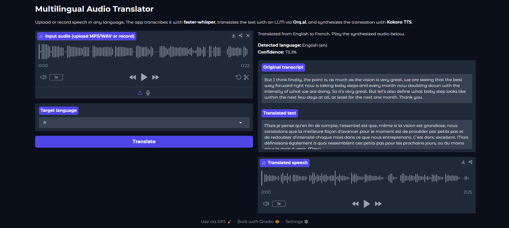

# Multilingual Audio Translator

> Transcribe speech in any language, translate it with an LLM, and hear the result spoken back in your chosen target language.

## Overview

Multilingual Audio Translator is a Gradio web application that converts spoken audio into translated speech. Users upload an MP3 or WAV file or record directly in the browser. The app transcribes the audio with faster-whisper, detects the source language automatically, translates the transcript through Orq.ai using Gemini, and synthesizes the translated text locally with Kokoro TTS. The interface returns the original transcript, translated text, detected language metadata, and a playable audio file.

## Demo



## Features

- Upload MP3 or WAV files, or record audio in the browser
- Automatic source language detection with confidence scores via faster-whisper (`large-v3`)
- LLM translation to 20 target languages through the Orq.ai router
- Local text-to-speech synthesis with Kokoro-82M (Apache-2.0, no cloud TTS required)
- Side-by-side output of original transcript, translated text, and synthesized audio
- Single API key required (`ORQ_API_KEY`) for the translation step only
- GPU acceleration for Whisper when CUDA is available; CPU fallback supported

## Tech Stack

Frameworks & Libraries:

- [faster-whisper](https://github.com/SYSTRAN/faster-whisper) for speech-to-text and language detection
- [OpenAI Python SDK](https://github.com/openai/openai-python) for Orq.ai-compatible API calls
- [Kokoro TTS](https://github.com/hexgrad/kokoro) for local speech synthesis
- [Gradio](https://www.gradio.app/) for the web interface
- [python-dotenv](https://github.com/theskumar/python-dotenv) for environment configuration
- [soundfile](https://github.com/bastibe/python-soundfile) and [NumPy](https://numpy.org/) for audio file handling

Additional Tools:

- STT: faster-whisper (whisper-large-v3)
- LLM: Orq.ai AI Router (`gemini-3-flash-preview`)
- TTS: Kokoro TTS
- Web Framework: Gradio

## Prerequisites

- Python 3.10, 3.11, or 3.12 (required by Kokoro TTS; Python 3.13+ is not yet supported)
- [espeak-ng](https://github.com/espeak-ng/espeak-ng/releases) installed on your system (required by Kokoro for phoneme generation)
- API keys for:
  - Orq.ai (`ORQ_API_KEY`) from the [Orq.ai dashboard](https://orq.ai/)
- Orq.ai provider setup: connect Google AI (or your Gemini provider) in the AI Router so `gemini-3-flash-preview` can run

## Installation

### 1. Clone the Repository

```bash
git clone https://github.com/Sumanth077/Hands-On-AI-Engineering.git
cd Hands-On-AI-Engineering/audio/multilingual_audio_translator
```

### 2. Create Virtual Environment (Recommended)

```bash
python -m venv venv
```

**Windows:**

```bash
venv\Scripts\activate
```

**macOS/Linux:**

```bash
source venv/bin/activate
```

### 3. Install Dependencies

```bash
pip install -r requirements.txt
```

For Japanese or Mandarin Chinese TTS output, install the optional G2P extras:

```bash
pip install "misaki[ja]"
pip install "misaki[zh]"
```

### 4. Set Up Environment Variables

```bash
cp .env.example .env
```

Edit `.env` and set your Orq.ai API key:

```env
ORQ_API_KEY=your-orq-api-key-here
```

On Windows Command Prompt, use `copy .env.example .env` instead of `cp`.

Optional overrides:

| Variable | Description |
|----------|-------------|
| `TRANSLATION_MODEL` | Orq.ai model ID (default: `gemini-3-flash-preview`) |
| `WHISPER_MODEL` | Whisper model size (default: `large-v3`) |

## Usage

### Running the Application

```bash
gradio app.py
```

You can also run:

```bash
python app.py
```

Open the local URL shown in the terminal (typically `http://127.0.0.1:7860`). Upload or record audio, select a target language from the dropdown, and click **Translate**.

### Example Usage

| Input audio | Target language | What the translator returns |
|-------------|-----------------|----------------------------|
| Spanish voice memo (MP3) | English | Detected `es` with confidence score, Spanish transcript, English translation, English WAV audio |
| English podcast clip | French | Detected `en`, English transcript, French translation, French WAV audio |
| Hindi recording | English | Detected `hi`, Hindi transcript, English translation, English WAV audio |
| Browser microphone recording | Japanese | Live capture transcribed, translated to Japanese text, Japanese speech via Kokoro TTS |
| German lecture excerpt | Portuguese | Detected `de`, German transcript, Portuguese translation, Portuguese WAV audio |
| Mandarin interview clip | English | Detected `zh`, Chinese transcript, English translation, English WAV audio |

## Project Structure

```
multilingual_audio_translator/
├── app.py              # Gradio UI and pipeline orchestration
├── transcriber.py      # faster-whisper transcription and language detection
├── translator.py       # Orq.ai LLM translation
├── synthesizer.py      # Kokoro TTS speech synthesis
├── requirements.txt    # Python dependencies
├── .env.example        # Environment variable template
├── .gitignore
├── README.md
└── assets/
    └── demo.png        # Demo screenshot for the README
```

## How It Works

1. **Audio upload**  
   The user uploads an MP3 or WAV file or records audio in the browser. Gradio passes the file path to `process_audio()` in `app.py`.

2. **Transcription**  
   `transcribe()` in `transcriber.py` loads a cached `WhisperModel` (`large-v3`) and runs `model.transcribe()` with voice activity detection enabled. It returns the full transcript, the detected language code, and a confidence score from the transcription metadata.

3. **Translation**  
   `translate()` in `translator.py` sends the transcript to Orq.ai through the OpenAI SDK with `base_url` set to `https://api.orq.ai/v3/router`. The default model is `gemini-3-flash-preview`. A system prompt instructs the model to return only the translated text in the user's chosen target language.

4. **Speech synthesis**  
   `synthesize()` in `synthesizer.py` maps the target language to a Kokoro `lang_code` and voice, runs `KPipeline` locally, concatenates the generated audio chunks, and writes a temporary WAV file at 24 kHz sample rate.

5. **Audio output**  
   Gradio displays the detected source language, the original transcript, the translated text, and an audio player for the synthesized speech. The user can read the translation and play the generated audio immediately.

**Pipeline flow:**

```
Audio file → faster-whisper (STT + language detection) → Orq.ai LLM (translate) → Kokoro TTS (synthesize) → Translated text + WAV
```
