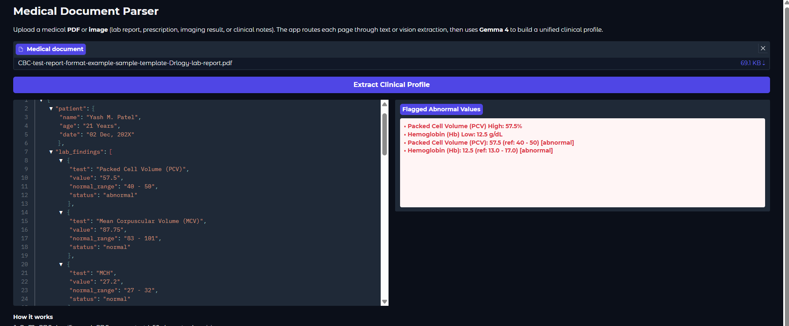

# Medical Document Parser

> Extract a structured clinical profile from medical PDFs and images using Gemma 4 vision.

## Overview

Medical Document Parser is a Gradio app that ingests lab reports, prescriptions, imaging results, and clinical notes. PyMuPDF classifies each PDF page as text or vision, routes content to the appropriate extraction path, and uses Gemma 4 (`gemma-4-31b-it`) via the Google AI Studio API to return a unified JSON clinical profile. Abnormal and critical values are surfaced in a dedicated flagged panel.

## Demo




## Features

- Upload medical PDFs or images (PNG, JPG, WEBP, BMP, TIFF)
- Per-page routing: text pages (>50 characters) vs vision pages (charts, scans, complex layouts)
- Vision pages rendered at 150 DPI with Pillow before analysis
- Structured JSON extraction with patient info, labs, imaging, and clinical signals
- Multi-page PDF support with merged results across pages
- Progress bar during processing
- Abnormal and critical values highlighted in red

## Tech Stack

| Layer | Technology |
|-------|------------|
| LLM | Gemma 4 (`gemma-4-31b-it`) via [Google AI Studio API](https://aistudio.google.com) (`google-genai`, thinking mode) |
| PDF parsing | PyMuPDF (`fitz`) |
| Image processing | Pillow |
| UI | Gradio |
| Config | `python-dotenv`, Pydantic |

## Prerequisites

- Python 3.10+
- [Google AI Studio API key](https://aistudio.google.com/app/apikey)

## Installation

```bash
git clone https://github.com/Sumanth077/Hands-On-AI-Engineering.git
cd Hands-On-AI-Engineering/multimodal/medical_document_parser
```

**Windows**

```bash
py -m venv .venv
.venv\Scripts\activate
pip install -r requirements.txt
copy .env.example .env
```

**macOS / Linux**

```bash
python3 -m venv .venv
source .venv/bin/activate
pip install -r requirements.txt
cp .env.example .env
```

Edit `.env` and set your API key before running the app.

## Usage

```bash
python app.py
```

Open the local Gradio URL shown in the terminal (typically `http://127.0.0.1:7860`). Upload a medical document, click **Extract Clinical Profile**, and review the JSON output and flagged values.

## Environment Variables

| Variable | Required | Description |
|----------|----------|-------------|
| `GOOGLE_API_KEY` | Yes | API key from [Google AI Studio](https://aistudio.google.com/app/apikey) |

Copy `.env.example` to `.env` and add your key:

```env
GOOGLE_API_KEY=your_google_ai_studio_api_key_here
```

## Project Structure

```text
medical-document-parser/
├── app.py                  # Gradio UI and orchestration
├── document_processor.py   # PDF/image page classification and rendering
├── llm_extractor.py        # Gemma 4 API calls and JSON parsing
├── merger.py               # Multi-page result merging
├── schemas.py              # Pydantic clinical profile schema
├── requirements.txt
├── .env.example
├── assets/
│   └── demo.png            # Demo screenshot
└── README.md
```
