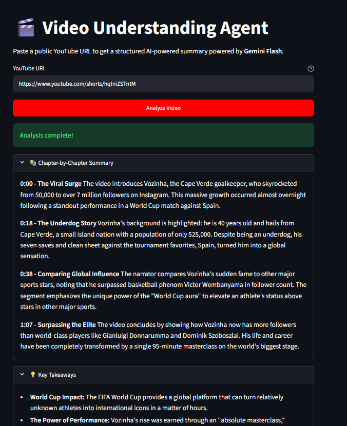

# Video Understanding Agent

<<<<<<< HEAD
> Paste a YouTube URL and get an AI-powered chapter summary, key takeaways, and action items — powered by Gemini 3 Flash.

## Overview

Video Understanding Agent lets you drop any public YouTube URL into a Streamlit interface and receive a structured breakdown of the video in seconds. Gemini 3 Flash reads the video natively through the Gemini API — no downloading, no transcription, no third-party tools.
=======
> Paste a YouTube URL and get an AI-powered chapter summary, key takeaways, and action items, powered by Gemini 3 Flash.

## Demo



## Overview

Video Understanding Agent lets you drop any public YouTube URL into a Streamlit interface and receive a structured breakdown of the video in seconds. Gemini 3 Flash reads the video natively through the Gemini API. No downloading, no transcription, no third-party tools.
>>>>>>> 1d1e9f137cfd1123edbae5d8e955ce0b9c7fcf4a

## Features

- **Chapter-by-chapter summary** with timestamps for each major segment
<<<<<<< HEAD
- **Key takeaways** — 5–8 bullet points covering the most important insights
- **Action items** — 4–6 concrete steps the viewer can act on immediately
=======
- **Key takeaways**: 5–8 bullet points covering the most important insights
- **Action items**: 4–6 concrete steps the viewer can act on immediately
>>>>>>> 1d1e9f137cfd1123edbae5d8e955ce0b9c7fcf4a
- Clean, expandable sections in a Streamlit UI
- Input validation rejects private, unavailable, or malformed URLs with clear error messages

## Tech Stack

| Layer | Tool |
|---|---|
| AI Model | Gemini 3 Flash (`gemini-3-flash-preview`) |
<<<<<<< HEAD
| AI SDK | Google Generative AI (`google-generativeai`) |
=======
| AI SDK | Google Gen AI SDK (`google-genai`) |
>>>>>>> 1d1e9f137cfd1123edbae5d8e955ce0b9c7fcf4a
| UI | Streamlit |
| Environment | python-dotenv |

## Prerequisites

- Python 3.9 or higher
- A Gemini API key from [aistudio.google.com](https://aistudio.google.com)

## Installation

**1. Clone the repository**

```bash
git clone https://github.com/Sumanth077/Hands-On-AI-Engineering.git
cd Hands-On-AI-Engineering/multimodal/video_understanding_agent
```

**2. Create and activate a virtual environment**

macOS / Linux:
```bash
python3 -m venv venv
source venv/bin/activate
```

Windows:
```bash
python -m venv venv
venv\Scripts\activate
```

**3. Install dependencies**

```bash
pip install -r requirements.txt
```

**4. Configure your API key**

```bash
cp .env.example .env
```

Open `.env` and replace `your_key_here` with your Gemini API key.

## Usage

```bash
streamlit run app.py
```

Open the local URL printed in the terminal (typically `http://localhost:8501`), paste a public YouTube URL, and click **Analyze Video**.

### Example

**Input:**
```text
https://www.youtube.com/watch?v=dQw4w9WgXcQ
```

**Output:**

> **Chapter-by-Chapter Summary**
<<<<<<< HEAD
> - `0:00 - Introduction` — The video opens with an energetic hook establishing the central theme...
> - `1:12 - Main Segment` — The speaker dives into the core content, covering...
=======
> - `0:00 - Introduction`: The video opens with an energetic hook establishing the central theme...
> - `1:12 - Main Segment`: The speaker dives into the core content, covering...
>>>>>>> 1d1e9f137cfd1123edbae5d8e955ce0b9c7fcf4a

> **Key Takeaways**
> - The most important insight from the video is...
> - A secondary pattern worth noting is...

> **Action Items & Recommendations**
> - Start by doing X within the next 24 hours...
> - Follow up with Y to reinforce the concept...

## Environment Variables

| Variable | Description | Where to get it |
|---|---|---|
| `GEMINI_API_KEY` | API key for Gemini models | [aistudio.google.com](https://aistudio.google.com) |

## Project Structure

```text
video-understanding-agent/
<<<<<<< HEAD
├── app.py              # Streamlit app — UI, validation, Gemini API call, response parsing
=======
├── app.py              # Streamlit app: UI, validation, Gemini API call, response parsing
>>>>>>> 1d1e9f137cfd1123edbae5d8e955ce0b9c7fcf4a
├── requirements.txt    # Python dependencies
├── .env.example        # Template for environment variables
└── .env                # Your local secrets (not committed)
```
<<<<<<< HEAD
=======

---

[Back to top](#video-understanding-agent)
>>>>>>> 1d1e9f137cfd1123edbae5d8e955ce0b9c7fcf4a
