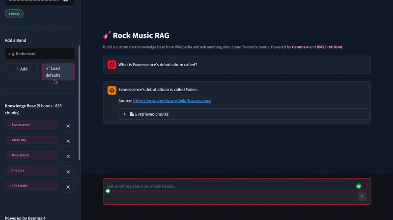

# Rock Music RAG

> A retrieval-augmented generation app that lets users build a custom rock music knowledge base from Wikipedia. Add any band, ask questions across all of them, and get sourced answers powered by BM25 retrieval.

## Demo



## Overview

Instead of guessing what Gemma 4 knows about rock music, this app fetches real Wikipedia pages for any band you choose, indexes them with BM25, and retrieves the most relevant chunks before passing them to Gemma 4 for a grounded answer with source URLs.

Start with the 10 default bands or build a completely custom knowledge base by adding any band Wikipedia has a page for.

## Features

- **Custom knowledge base:** Add or remove any band at runtime — the index rebuilds instantly
- **BM25 retrieval:** Fast keyword-based retrieval that finds the most relevant Wikipedia chunks for each query
- **Grounded answers:** Gemma 4 answers only from retrieved context and cites the source URL
- **Retrieved chunk viewer:** See exactly which passages the model used to form its answer
- **10 default bands:** Load Audioslave, Nirvana, Dire Straits, and 7 more with one click

## Why Gemma 4?

Gemma 4 (`gemma-4-26b-a4b-it`) is Google DeepMind's open model family with capabilities that make it well-suited for RAG:

| Capability | Detail |
|---|---|
| Strong Q&A | 85.2% on MMLU benchmark |
| Multilingual | 140 languages supported |
| Scale | 26B parameters via Google AI API |
| Accessible | Free via Google AI Studio |

## Tech Stack

| Layer | Technology |
|---|---|
| LLM | Gemma 4 (`gemma-4-26b-a4b-it`) via Google GenAI SDK |
| Retrieval | BM25 (`rank-bm25`) |
| Data source | Wikipedia API (`wikipedia`) |
| UI | Streamlit |

## Prerequisites

- Python 3.10 or later
- A Google API key — get one free at [aistudio.google.com](https://aistudio.google.com)

## Installation

```bash
git clone https://github.com/Sumanth077/Hands-On-AI-Engineering.git
cd Hands-On-AI-Engineering/rag_apps/rock_music_rag
cp .env.example .env
```

Add your Google API key to `.env`.

## Usage

```bash
uv run streamlit run app.py
```

Open `http://localhost:8501`, enter your API key, and click **Load defaults** or add your own bands.

## Example Questions

```text
Who was the lead singer of Audioslave?
What was Nirvana's breakthrough album in 1991?
Who guests on Dire Straits' Money for Nothing?
What story does Green Day's American Idiot tell?
Were The Smiths influential?
Who is the male vocalist on Evanescence's Bring Me to Life?
What was Sum 41's original name?
```

## Environment Variables

| Variable | Description |
|---|---|
| `GOOGLE_API_KEY` | Authenticates Gemma 4 requests via Google GenAI SDK |

## Project Structure

```text
rock_music_rag/
├── rag.py            # RockRAG class: fetch, index, retrieve, generate
├── app.py            # Streamlit UI
├── pyproject.toml
├── .env.example
└── assets/
    └── demo.gif
```

## How It Works

```
User adds a band
    │
    ▼
Wikipedia API fetches the full page
    │
    ▼
Text is split into 2-sentence chunks
    │
    ▼
BM25 index rebuilt over all chunks
    │
    ▼
User asks a question
    │
    ▼
BM25 retrieves top-5 most relevant chunks
    │
    ▼
Gemma 4 generates a grounded answer with source URLs
```
