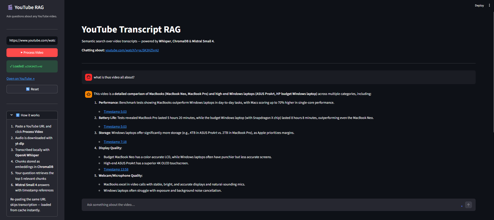

# YouTube Transcript RAG

> Chat with any YouTube video using local transcription and semantic search powered by Mistral AI.

## Overview

Paste a YouTube URL, and the app downloads the audio, transcribes it locally with Whisper, and stores the transcript as embeddings in ChromaDB. You can then ask questions in a chat interface and get answers grounded in the video content — complete with clickable timestamp links pointing to the exact moment in the video.

## Demo



## Features

- Local transcription with OpenAI Whisper — no third-party transcription API needed
- Semantic retrieval of the top 5 most relevant transcript chunks per question
- Grounded answers from Mistral Small 4 with inline timestamp references
- Persistent ChromaDB storage — the same URL is never re-transcribed
- Source chunks shown in a collapsible expander with clickable timestamps
- Multi-turn chat with the last 10 turns kept in context

## Tech Stack

| Layer | Library / Tool |
|---|---|
| UI | Streamlit |
| Audio download | yt-dlp + ffmpeg |
| Transcription | OpenAI Whisper (local) |
| Embeddings | sentence-transformers `all-MiniLM-L6-v2` (local) |
| Vector database | ChromaDB (local persistent storage) |
| LLM | Mistral Small 4 (`mistral-small-latest`) |
| LLM framework | LangChain (`langchain-mistralai`) |

## Prerequisites

- Python 3.10+
- ffmpeg

**Install ffmpeg:**

```bash
# Windows
winget install ffmpeg

# macOS
brew install ffmpeg
```

A [Mistral AI API key](https://platform.mistral.ai) is required for answer generation. Transcription and embeddings run entirely locally.

## Installation

**1. Clone the repository**

```bash
git clone https://github.com/Sumanth077/Hands-On-AI-Engineering.git
cd Hands-On-AI-Engineering/rag_apps/youtube_transcript_rag
```

**2. Create and activate a virtual environment**

```bash
# Windows
python -m venv .venv
.venv\Scripts\activate

# macOS / Linux
python -m venv .venv
source .venv/bin/activate
```

**3. Install dependencies**

```bash
pip install -r requirements.txt
```

**4. Configure your API key**

```bash
cp .env.example .env
```

Open `.env` and set your `MISTRAL_API_KEY`.

## Usage

```bash
streamlit run app.py
```

The app opens in your browser at `http://localhost:8501`.

1. Paste a YouTube URL in the sidebar — for example:
   ```text
   https://www.youtube.com/watch?v=dQw4w9WgXcQ
   ```
2. Click **Process Video**. Whisper transcribes the audio locally (a few minutes for longer videos).
3. Ask a question in the chat input — for example:
   ```text
   What is the main topic discussed in the video?
   ```
4. The app retrieves the most relevant transcript segments and returns a grounded answer:
   ```text
   The video focuses on [topic], as explained at [0:42](https://youtu.be/dQw4w9WgXcQ?t=42)
   and revisited at [2:15](https://youtu.be/dQw4w9WgXcQ?t=135).
   ```
5. Expand **Source transcript chunks** below the answer to read the raw segments and jump to any timestamp.

Pasting the same URL again loads the transcript from ChromaDB instantly — no re-transcription.

## Environment Variables

| Variable | Description |
|---|---|
| `MISTRAL_API_KEY` | API key from [platform.mistral.ai](https://platform.mistral.ai) |

## Project Structure

```text
youtube-transcript-rag/
├── app.py            # Streamlit app — pipeline, retrieval, chat UI
├── requirements.txt  # Python dependencies
├── .env.example      # Environment variable template
└── chroma_db/        # Persistent ChromaDB storage (auto-created)
```
